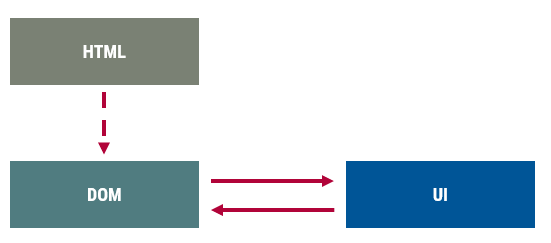
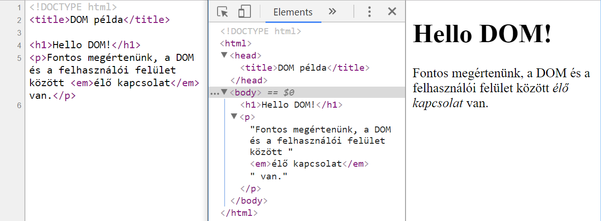

<!-- ## Ismétlés {data-background-image="desert.jpg" .new-section} -->

<!-- 
:::::::::::::: {.columns}
::: {.column width="40%"}
contents...
:::
::: {.column width="60%"}
contents...
:::
::::::::::::::
 -->

<!-- <iframe style="background-color: white;" frameborder="0" src="./teszt.html" height="50" width="600"></iframe> -->

<!-- ## {data-background-iframe="https://mdn.mozillademos.org/en-US/docs/Web/API/KeyboardEvent/code$samples/Exercising_KeyboardEvent?revision=1559366" data-background-interactive="true"} -->

<!-- 
```js
✒>function add(a, b) {<✒
✒>  return a + b<✒;
}
```
-->

<!-- → -->

::: title
Webprogramozás
:::

### Felületi elemek programozása: a DOM

:::::: {.columns}
::: {.column width="33%"}
<small>
**Visnovitz Márton**  
egyetemi tanársegéd  
visnovitz.marton@inf.elte.hu
</small>
:::
::: {.column width="33%"}
<small>
**Gerely Viktor**  
demonstrátor  
mohmas@inf.elte.hu
</small>
:::
::: {.column width="33%"}
<small>
**Horváth Győző**  
egyetemi docens  
horvath.gyozo@inf.elte.hu
</small>
:::
::::::

<small>
1117 Budapest, Pázmány Péter sétány 1/c., 2.408  
Tel: (1) 372-2500/8469\
</small>

--------------------------

## Ismétlés  {data-state="new-section"}

--------------------------

## JavaScript nyelvi elemek

::: {.tasklist .complete}
- Alapok 
  + C-alapú szintaxis
  + vezérlési szerkezetek
- Típusok: 
  + Egyszerű: szöveg, szám, logikai
  + Összetett: objektum, tömb, függvény
:::

--------------------------

## Felületi elemek programozása {data-state="new-section"}

--------------------------

## Példa

- Feladat
  + Bekérni a nevet, pl. "Senki bácsi" 
  + Kiírni: "Hello Senki bácsi!"
- Űrlap
  + Gomb lenyomása
  + Érték kiolvasása
  + Eredmény megjelenítése

--------------------------

## Megoldás lépései

::: {.tasklist}
1. Reagálni a gomb lenyomására.
2. Kiolvasni a szöveges beviteli mező értékét (beolvasás).
3. Előállítani a bemenet alapján a kimenetet, azaz az üdvözlő szöveget (feldolgozás). 
4. Megjeleníteni az üdvözlő szöveget (kiírás).
::: 

--------------------------

::: {.example}

<form>
  Név: <input type="text" id="nev">
  <br>
  <input type="button" value="Say hello!" id="gomb" onclick="hello()">
  <br>
  <span id="kimenet"></span>
</form>

:::

<script>
function nevbolUdvozles(nev) {
  return `Hello ${nev}!`;
}
function hello() {
  let nev = document.querySelector('#nev').value;
  let udvozles = nevbolUdvozles(nev);
  document.querySelector('#kimenet').innerHTML = udvozles;
}
</script>

```html
<form>
  Név: <input type="text"> <br>
  <input type="button" value="Say hello!">
</form>
```

--------------------------

## Megoldás lépései

::: {.tasklist}
1. Reagálni a gomb lenyomására.
2. Kiolvasni a szöveges beviteli mező értékét (beolvasás).
:::
::: {.tasklist .complete}
3. Előállítani a bemenet alapján a kimenetet, azaz az üdvözlő szöveget (feldolgozás). 
:::
::: {.tasklist}
4. Megjeleníteni az üdvözlő szöveget (kiírás).
::: 

```js
function greet(name) {
  return `Hello ${name}`
}
```

--------------------------

## Felhasználói felület

- Interaktivitás
  + adatok megadása (beolvasás)
  + információ megjelenítése (kiírás)
- Elemei
  + **HTML**: oldal szerekezetének leírása
  + **CSS**: megjelenés, stílus
  + **JavaScript**: program a felület működtetésére
- **→ INTERFÉSZ A HTML ELEMEKHEZ**

--------------------------

## Dokumentum Objektum Modell (DOM)

- HTML elemek belső ábrázolása
- HTML elemeknek megfelelő JS objektumok hierarchiája



--------------------------

## Dokumentum Objektum Modell (DOM)



<small>A forrás és a DOM eltérhet egymástól.</small>

--------------------------

## Dokumentum Objektum Modell (DOM)

- Programozási interfész (a felület felé)
- Bemeneti-kimeneti interfész


--------------------------

:::::::::::::::::::: {.columns}
::: {.column}
::: {style="color: orange; font-size: 1.3em"}
**DOM Core**
:::

+ csomópontok fája
+ ábrázolás és műveletek
:::
::: {.column}
::: {style="color: lightblue; font-size: 1.3em"}
**HTML DOM**
:::

+ HTML elemek fája
:::
:::::::::::::::::::::


--------------------------

## Dokumentum Objektum Modell

- HTML és XML dokumentumok programozási felülete
- Szabványos interfész fastruktúra alapú hierarchiához
- Objektumstruktúra, faszerkezet
- DOM gyökere: `document`
- DOM csomópontok
  + dokumentum
  + elem
  + attribútum
  + szöveges csomópont

--------------------------

## Szöveges csomópontok

:::::::::::::::::::: {.columns}
::: {.column style="width: 55%"}
```html
<!doctype html>
<html lang="en">
  <head>
    <meta charset="utf-8">
    <title></title>
  </head>
  <body>
    <p id="par1">Bekezdés.</p>
    <p class="aktiv">Még egy bekezdés.</p>
    <ul>
      <li>első</li>
      <li class="aktiv">második</li>
    </ul>
    <form name="form1">
      <input type="radio" name="r1" value="elso">
      <input type="radio" name="r1" value="masodik">
    </form>
  </body>
</html>
```
:::

::: {.column style="width: 45%"}

:::
:::::::::::::::::::

--------------------------

## Műveletcsoportok

::::::::::::::::::::::: {.columns}
::: {.column}
- Elemek kiválasztása
- Szerkezet bejárása
- Szerkezet módosítása
    + attribútumok
    + új elem/attribútum létrehozása
    + módosítás
    + törlés
:::

::: {.column}

:::
::::::::::::::::::::::::

--------------------------

## Elem(ek) kiválasztása {data-state="new-section"}

--------------------------

## Elem(ek) kiválasztása

CSS szelektorral:

- egy elem: `document.querySelector(sel)`
- több elem: `document.querySelectorAll(sel)`

```html
<form>
  Név: 
  <input id="nev" value="Frodó">
  <button>Nyomj meg!</button>
</form>
<script>
  console.log( document.querySelector("#nev") );
  console.log( document.querySelectorAll("form > *") );
</script>
```
--------------------------

## CSS szelektorok

- Elemek kiválasztása
  - az elem nevével (`button`),
  - az azonosítójával (`#fejlec`),
  - az alkalmazott stílusosztály alapján (`.fontos`),
  - az attribútumaival (`[name=nev]`),
  - mindenkit kiválasztva (`*`), illetve
  - ezek kombinálásával (`input.hibas[type=text]`)
- Hierarchikus viszonyok
  - szülő-gyerek (`form > input`)
  - szülő-leszármazott (`#torzs div`)
  - közvetlenül utána jövő testvér (`p + span`)
  - utána jövő testvérek (`p ~ span`)

[Dokumentáció](https://developer.mozilla.org/en-US/docs/Web/CSS/CSS_Selectors)

--------------------------

## Több elem kiválasztása

```html
<ul>
    <li>First</li>
    <li>Second</li>
    <li>Third</li>
</ul>
```
```js
const listItems = document.querySelectorAll('ul>li')

// Array-like object
for (const li of listItems) { /*...*/ }     // OK
listItems.forEach(li => { /*...*/ })        // Wrong: not an array

// Transforming to array
const listItemsArray = Array.from(listItems)
listItemsArray.forEach(li => { /*...*/ })   // OK
```

--------------------------

## Adott elem alatti kiválasztás

- `elem.querySelector(sel)`
- `elem.querySelectorAll(sel)`

```html
<div class="first">
    <span>Apple</span>
</div>
<div class="second">
    <span>Pear</span>
</div>
```
```js
const firstDiv = document.querySelector('div.first')
const spanInFirstDiv = ✒>firstDiv<✒.querySelector('span')
```

--------------------------

## Példafeladat

```html
<form>
  Név: <input type="text" ✒>id="name"<✒ > <br>
  <input type="button" value="Say hello!">
</form>
```
```js
const nameInput = document.querySelector('#name')
const nameInput = document.querySelector('form input[type=text]')
```

--------------------------

## DOM elem tulajdonságai és metódusai {data-state="new-section"}

--------------------------

## DOM elem tulajdonságai és metódusai

- [szabvány](https://www.w3.org/TR/2017/REC-html52-20171214/)
- [dokumentáció](https://developer.mozilla.org/en-US/docs/Web/API)
- analóg módszer (HTML, 80%)
- felfedező módszer (fejlesztői eszköztár, óvatosan)

--------------------------

## Analóg módszer

- CamelCase átírási mód
- Tulajdonságok

| HTML attribútum | DOM tulajdonság |
| --------------- | --------------- |
| `type`          | `type`          |
| `value`         | `value`         |
| `readonly`      | `readOnly`      |
| `maxlength`     | `maxLength`     |

--------------------------

## További fontosabb tulajdonságok

- `innerHTML`, `innerText`: az elem nyitó- és záróelem közötti HTML vagy szöveg

```html
<p>This is a <span>text</span></p>
```
```js
const p = document.querySelector('p')
// reading
p.innerHTML // 'This is a <span>text</span>'
p.innerText // 'This is a text'
// writing
p.innerHTML = 'This is a <strong>new</strong> text'
```

--------------------------

## Példafeladat

```html
<form>
  Név: <input type="text" id="name" ✒>value="Győző"<✒ > <br>
  <input type="button" value="Say hello!"> <br>
  <output></output>
</form>
```
```js
// Reading
const nameInput = document.querySelector('#name')
const name = nameInput✒>.value<✒
// Writing
const output = document.querySelector('output')
output.innerHTML = `Hello ${name}!`
```

--------------------------

## A DOM mint I/O {data-state="new-section"}

--------------------------

## A DOM mint I/O

- A felhasználó a felhasználói felületen keresztül lép kapcsolatba a programmal
- programbeli elérés a DOM-on keresztül lehetséges
- program számára a DOM az I/O

```js
// Typical JavaScript program

// reading (from DOM)
// processing (independent from I/O)
// writing (to DOM)
```

--------------------------

## A DOM mint I/O

- Beolvasás: DOM objektum tulajdonságának lekérdezése
- Kiírás: DOM objektum tulajdonságának módosítása

```html
<!-- beolvasás -->
<input type="checkbox" id="elfogad" checked>
<script>
  const elfogad = document.querySelector("#elfogad").checked;
</script>

<!-- kiírás -->

<script>
  const url = "http://kepek.hu/alma.png";
  document.querySelector("#kep").src = url;
</script>
```

--------------------------

## Példa DOM I/O

```html
<input type="radio" name="nem" value="ferfi" checked> férfi
<input type="radio" name="nem" value="no"> nő
Leánykori név: <input id="leanykori_nev">
<script>
  // beolvasás
  const no = document.querySelector("[name=nem][value=no]").checked;
  // kiírás
  document.querySelector("#leanykori_nev").hidden = !no;
</script>
```

--------------------------

## Új elemek létrehozása

- kiírás egy speciális formája
- szövegesen
- `innerHTML` tulajdonság írása
- tetszőleges mennyiség

```html
<div id="kimenet"></div>
<script>
  const udvozles = "<h1>Hello <em>mindenki</em></h1>";
  document.querySelector("#kimenet").innerHTML = udvozles;
</script>
```

--------------------------

## HTML generálás

```js
// Rövid statikus szöveg megadása
const s = `<h1>Hello there!</h1>`;

// Többsoros statikus szöveg megadása
const s = `
  <div>
    <p>No, <strong>I</strong> am your father!</p>
  </div>
`;

// Változók behelyettesítése
const pontszam = 100;
const s = `Összesen ${pontszam} pontot gyűjtöttél!`;

// Tömbök kiírása leképezéssel
const nevek = ["Sára", "Zsófi", "Dávid", "Matyi", "Veronika"];
const s = `
  <ul>
    ${nevek.map(nev => `
      <li>${nev}</li>
    `).join("")}
  </ul>
`;

// Feltételes kiírás (elágazás)
const homerseklet = 5;
const s = `
  <span>Hú de nagyon
  ${homerseklet > 20 ? "meleg" : "hideg"}
  van</span>
`;

// Függvényekkel
function lista(nevek) {
  return `
    <ul>
      ${nevek.map(listaElem).join("")}
    </ul>
  `;
}
function listaElem(s) {
  return `<li>${s}</li>`;
}
const nevek = ["Sára", "Zsófi", "Dávid", "Matyi", "Veronika"];
const s = lista(nevek);
```

--------------------------

## Új elemek létrehozása

Programozottan:

- létrehozás:
  + `document.createElement(elem)`
- beszúrás: 
  + `parent.appendChild(child)`: szülő gyerekeihez utolsóként hozzáadja az új elemet
  + `parent.insertBefore(newChild, refChild)`: referencia elé beszúrja az új elemet

::::::::::::::::::::: {.columns}
::: {.column style="width: 30%"}
```html
<body>
  <ul>
    <li>First</li>
    <li>Second</li>
    ✒> <✒    
    <li>Third</li>
  </ul>
  ✒> <✒    
</body>
```
:::

::: {.column style="width: 70%"}
```js
const p = document.createElement('p')
document.body.appendChild(p)

const newLi = document.createElement('li')
const ul = document.querySelector('ul')
const refLi = ul.querySelector('li:nth-of-type(3)')
ul.insertBefore(newLi, refLi)
```
:::
::::::::::::::::::::::

--------------------------

## Stílusattribútumok programozása {data-state="new-section"}

--------------------------

## Ismétlés

```html
<div 
  class="rodian bounty-hunter" 
  style="position: absolute; top: 50px;"
>
    Greedo
</div>
```

--------------------------

## Stílusattribútum programozása

`style` tulajdonság olvasása/írása

| CSS stílustulajdonság    | `style` objektum tulajdonsága |
| ------------------------ | ----------------------------- |
| `left`                   | `left`                        |
| `background-color`       | `backgroundColor`             |
| `border-bottom-width`    | `borderBottomWidth`           |
| `border-top-left-radius` | `borderTopLeftRadius`         |

--------------------------

## Stílusattribútum programozása

```html
<div style="position: absolute" id="mozgo_elem"></div>
<script>
  document.querySelector("#mozgo_elem").style.top  = "25px";
  document.querySelector("#mozgo_elem").style.left = "42px";
</script>
```

--------------------------

## Objektum stílus

- `elem.style`
- `CSSStyleDeclaration` objektum az összes stílustulajdonsággal
- Tetszőleges tulajdonság beállítható (írás)
- Lekérdezhető stílustulajdonságok (olvasás):
    + a `style` attribútumon keresztül voltak megadva;
    + JavaScriptből határoztuk meg az értéküket.

:::::::::::::::::: {.columns}
::: {.column style="width: 45%"}
```html
<style>
.box {
  position: absolute;
  width: 100px; height: 100px;
}
</style>
<div class="box" 
     style="left: 20px"></div>
```
:::

::: {.column style="width: 55%"}
```js
const box = document.querySelector("div")
box.style.top = "30px"

box.style.top       // "30px"  <-- JS
box.style.left      // "20px"  <-- style attr
box.style.width     // ""
box.style.position  // ""
```
:::
::::::::::::::::::::

--------------------------

## Számított stílus

- `window.getComputedStyle(elem)`
- A böngésző által nyilvántartott stílustulajdonságok
- A rövidítések (pl. `border`, `background`, stb.) nem érhető el, csak az elemi tulajdonságok.

:::::::::::::::::: {.columns}
::: {.column style="width: 45%"}
```html
<style>
.box {
  position: absolute;
  width: 100px; height: 100px;
}
</style>
<div class="box" 
     style="left: 20px"></div>
```
:::

::: {.column style="width: 55%"}
```js
const box = document.querySelector("div")
box.top = "30px"

const compStyle = window.getComputedStyle(box)
compStyle.top       // "30px"
compStyle.left      // "20px"
compStyle.width     // "100px"
compStyle.position  // "absolute"
```
:::
::::::::::::::::::::

--------------------------

## Stílusosztály programozása

`classList` tulajdonság

- `add(osztály)`
- `remove(osztály)`
- `toggle(osztály)`
- `contains(osztály)`

```html
<div class="rodian bounty-hunter">Greedo</div>
```

--------------------------

## Stílusosztály programozása

`add`, `remove`, `toggle`, `contains`

```html
<div class="piros barna sarga">
```

```js
const div = document.querySelector('div')
div.classList.remove("barna")
div.classList.add("zold")

// váltogatás
div.classList.toggle("zold")

// feltételes megjelenítés
div.classList.toggle("zold", i < 10 )

// van-e adott stílusosztály
div.classList.contains("piros")  // true

// több hozzáadása egyszerre
div.classList.add("kek", "arany")
```

--------------------------

## DOM tulajdonságok és metódusok {data-state="new-section"}

--------------------------

## Szerkezet bejárása

- Bejárás
    + gyerekek
        - `children`, `firstElementChild`, `lastElementChild`, `childElementCount`
        - `childNodes`, `firstChild`, `lastChild`
    + szülő/ős
        - `parentNode`, `parentElement`
        - `closest(css_selector)`
    + testvérek
        - `nextElementSibling`, `previousElementSibling`
        - `nextSibling`, `previousSibling`
- Csomópont típusa
  + `nodeType === 1`: elem
  + `nodeType === 3`: szöveges csomópont

--------------------------

## Attribútum programozás

- `getAttribute(name)`
- `setAttribute(name, value)`
- `hasAttribute(name)`
- `removeAttribute(name)`
- `toggleAttribute(name[, predicate])`

```html
<button type="submit" data-id="10" disabled>A button</button>
```
```js
const b = document.querySelector('button')
// reading
b.getAttribute('type')      // 'submit'
b.getAttribute('data-id')   // '10'
b.getAttribute('disabled')  // ''
b.getAttribute('foo')       // null or ''
b.hasAttribute('disabled')  // true
// writing
b.setAttribute('name', 'send')
b.setAttribute('hidden', '')  // boolean attribute
b.toggleAttribute('disabled') // toggle boolean attribute
```

--------------------------

## Attribútum programozás

`data-*` attribútum → `dataset` tulajdonság

```html
<div 
  data-id="10"
  data-some-text="foo"
></div>
```
```js
const div = document.querySelector('div')
// reading
div.dataset.id        // "10"
div.dataset.someText  // "foo"
// writing
div.dataset.someText = "bar"
div.dataset.user = "John"               // --> data-user="John"
div.dataset.dateOfBirth = "2000-12-12"  // --> data-date-of-birth="2000-12-12"
// removing
delete div.dataset.id
// checking
'someText' in el.dataset  // true
'id' in el.dataset        // false
```

--------------------------

## Szerkezet módosítása

- `parent.appendChild(elem)`: beszúrás
- `parent.insertBefore(elem, ref)`: beszúrás
- `parent.removeChild(elem)`: törlés
- `parent.replaceChild(elem, oldElem)`: csere
- Ha `elem` létezik, akkor mozgatás

--------------------------

## Példa: hányadik elem

```html
<ul>
    <li>első</li>
    <li>második</li>
    <li>harmadik</li>
    <li>negyedik</li>
    <li>ötödik</li>
</ul>
```
```js
function pozicio( el ) {
   let db = 0;

   // kiválasztás és számolás az elemtől visszafelé
   while ( null != el ) {
      // előző testvérre lépés
      el = el.previousElementSibling;
      db++;
   }
   
   return db;
}
pozicio(document.querySelector('ul > li:nth-child(2)')); // 2
```

--------------------------

## Régi megoldások {data-state="new-section"}

--------------------------

## Böngésző I/O

- `alert(text)`
- `confirm(text)`
- `prompt(text, default)`

```js
alert('Hello világ!');

const kerdes = confirm('Szereted a csokit?');

const nev = prompt('Mi a neved?', 'Senki bácsi');

console.log(`Helló ${nev}!`);
```

--------------------------

## Elemek kiválasztása

- `document`
    + `getElementById(id)`
    + `getElementsByName(name)`
- `document`/elem
    + `getElementsByTagName(tagName)`
    + `getElementsByClassName(className)`
    + **`querySelector(css_selector)`**
    + **`querySelectorAll(css_selector)`**

--------------------------

## Stílusosztály programozása

- `className` tulajdonság
- `class` attribútum szöveges értéke
- olvasható/írható
- elavult

```html
<div class="human hero">Aragorn</div>
```
```js
const div = document.querySelector('div')
div.className   // 'human hero'
div.className = 'human king'
```

--------------------------

## Elemi eseménykezelés {data-state="new-section"}

--------------------------

## Eseménykezelés

- események (pl. kattintás)
- eseménykezelők (függvények)
- `elem.addEventListener('type', fn)`

```js
const button = document.querySelector('button')
button.addEventListener('click', onClick)
function onClick() {
  console.log('clicked');
}
```

--------------------------

## Példafeladat

```html
<form>
  Név: <input type="text" id="name" value="Győző"> <br>
  <input type="button" value="Say hello!"> <br>
  <output></output>
</form>
```
```js
const button = document.querySelector('input[button]')
button.addEventListener('click', onGreet)
function onGreet() {
  // Reading
  const nameInput = document.querySelector('#name')
  const name = nameInput.value
  // Process
  const greeting = `Hello ${name}!`
  // Writing
  const output = document.querySelector('output')
  output.innerHTML = greeting
}
```

## Összefoglalás {data-state="topic"}

- DOM a felhasználói felület programozási interfésze
- Elemek kiválasztása: `document.querySelector(css-selector)`
- Tulajdonságai: analóg módszer
- Alap eseménykezelés: `elem.addEventListener('click', onClick)`
