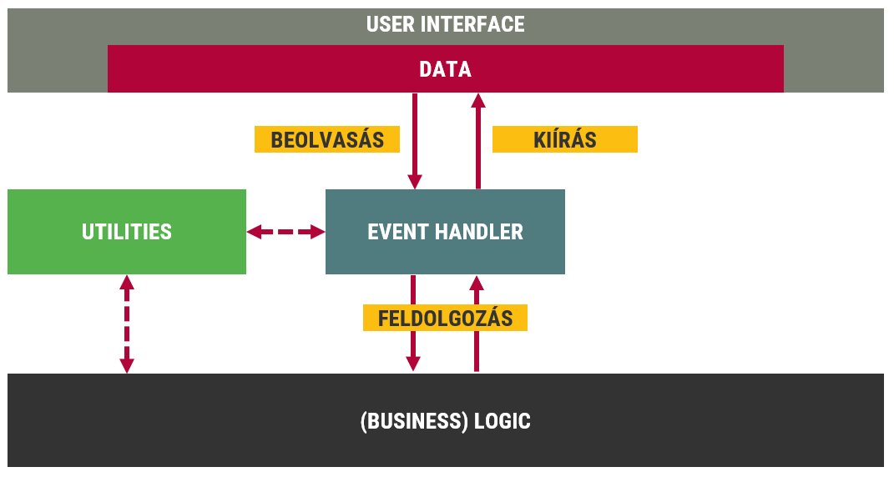
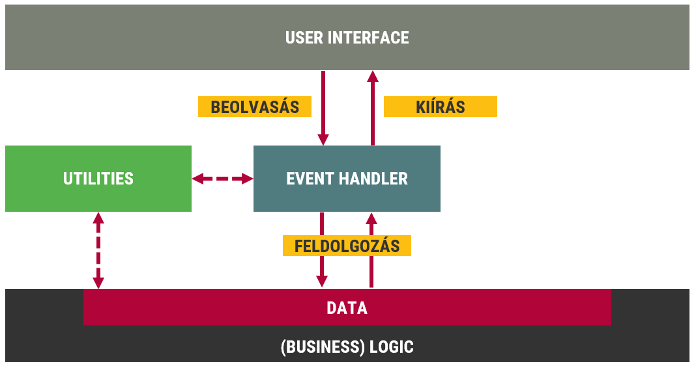
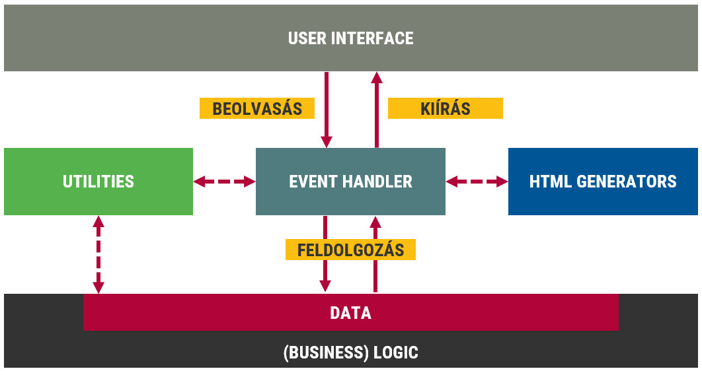

::: title
Webprogramozás
:::

### Kimenet, kódszervezés, időzítők

:::::: {.columns}
::: {.column width="33%"}
<small>
**Visnovitz Márton**  
egyetemi tanársegéd  
visnovitz.marton@inf.elte.hu
</small>
:::
::: {.column width="33%"}
<small>
**Gerely Viktor**  
demonstrátor  
mohmas@inf.elte.hu
</small>
:::
::: {.column width="33%"}
<small>
**Horváth Győző**  
egyetemi docens  
horvath.gyozo@inf.elte.hu
</small>
:::
::::::

<small>
1117 Budapest, Pázmány Péter sétány 1/c., 2.408  
Tel: (1) 372-2500/8469\
</small>

------

## Ismétlés {data-state="new-section"}

------

## Ismétlés - nyelvi elemek

- [x] Dinamikusan típusos
- [x] Interpretált nyelv
- [x] Szintaxis C++-hoz hasonló
- [x] Adatszerkezetek (elemi, összetett)
- [x] Funkcionális aspektus
- [x] OOP-s aspektus

------

## Ismétlés - DOM

- [x] HTML elemek belső ábrázolása
- [x] Programozási interfész (API)
- [x] Bemeneti-kimeneti interfész


------

## Ismétlés - nyelvi elemek

- [x] Dinamikusan típusos
- [x] Interpretált nyelv
- [x] Szintaxis C++-hoz hasonló
- [x] Adatszerkezetek (elemi, összetett)
- [x] Funkcionális aspektus
- [x] OOP-s aspektus

------

## Ismétlés - DOM

- [x] HTML elemek belső ábrázolása
- [x] Programozási interfész (API)
- [x] Bemeneti-kimeneti interfész


------

## Ismétlés -- DOM

- [x] Elemek kiválasztása
  - `document.querySelector('css selector')`
  - `document.querySelectorAll('css selector')`
- [x] Elem (JavaScript objektum) tulajdonságai
  - Analógia: Webfejlesztés → Webprogramozás
  - írás/olvasás
  - tulajdonságok (pl. `innerHTML`)
  - metódusok
- [x] Eseménykezelés
  - Eseménytípusok

------

## Ismétlés -- Eseménykezelés

- [x] `elem.addEventListener(type, handler)`
- [x] Interakció eszköze
- [x] Mini-programok
- [x] Eseményobjektum (`event`)
- [x] Alapértelmezett műveletek megakadályozása  
  (`preventDefault`)
- [x] Buborékolás
- [x] Delegálás (`delegate`)

------

## Elemek létrehozása, HTML generálás {data-state="new-section"}

------

## Új elemek létrehozása

- A kiírás egy speciális formája
- A HTML kód szövegesen
- `innerHTML` tulajdonság írása
- Akár egyszerre több elemet is

```html
<div id="output"></div>
<script>
  const greeting = "<h1>Hello <em>World</em></h1>";
  const output = document.querySelector("#output");
  output.innerHTML = greeting;
</script>
```

------

## HTML generálás

```js
// Rövid statikus szöveg megadása
const html1 = `<h1>Hello there!</h1>`;

// Többsoros statikus szöveg megadása
const html2 = `
  <div>
    <p>No, <strong>I</strong> am your father!</p>
  </div>
`;

// Változók behelyettesítése
const callsign = 'Red 5';
const html3 = `${callsign}, standing by.`;

// Tömbök kiírása leképezéssel
const callsigns = ["Red 10", "Red 7", "Red 3", "Red 6", "Red 9"];
const html4 = `
  <p>All wings, report in.</p>
  <ul>
    ${callsigns.map(callsign => `
      <li>${callsign}, standing by.</li>
    `).join("")}
  </ul>
`;

// Feltételes kiírás (elágazás)
const chanceOfSuccess = 0.4;
const html5 = `
  <span>
    I have a 
    ${chanceOfSuccess < 0.5 ? "bad" : "good"}
    feeling about this.
  </span>
`;

// Függvényekkel
function hanDescription(properties) {
  return `
    You
    <ul>
      ${properties.map(hanProperty).join("")}
    </ul>
    Nerf Herder!
  `;
}

function hanProperty(property) {
  return `<li>${property}</li>`;
}

const hanProperties = [
  "stuck up",
  "half witted",
  "scruffy looking"
];
const html6 = hanDescription(hanProperties);
```

------

## Új elemek létrehozása

Programozottan:

- Létrehozás:
  - `document.createElement(elementName)`
- Beszúrás: 
  - `parent.appendChild(childElement)`  
    szülő gyerekeihez utolsóként hozzáadja az új elemet
  - `parent.insertBefore(newChildElement, ref)`  
    referencia elé beszúrja az új elemet
  - `ref.insertAdjacentElement(position, newElement)`  
    egy adott elemhez képes szúr be új elemet

------

## Új elemek beszúrása

::::::::::::::::::::: {.columns}
::: {.column style="width: 33%"}
```html
<body>
  <ul>
    <li>First</li>
    <li>Second</li>
    ✒> <✒    
    <li>Third</li>
  </ul>
  ✒> <✒    
</body>
```
:::

::: {.column style="width: 67%"}
```js
const p = document.createElement('p');
document.body.appendChild(p);

const newLi = document.createElement('li');
const ul = document.querySelector('ul');
const refLi = 
  ul.querySelector('li:nth-of-type(3)');
ul.insertBefore(newLi, refLi);
```
:::
::::::::::::::::::::::

------

## Stílusattribútumok programozása {data-state="new-section"}

------

## Ismétlés

```html
<div class="rodian bounty-hunter" style="bottom: 72in">
  Greedo
</div>
```

------

## Stílusattribútum programozása

`style` tulajdonság olvasása/írása

| CSS stílustulajdonság    | `style` objektum tulajdonsága |
| ------------------------ | ----------------------------- |
| `left`                   | `left`                        |
| `background-color`       | `backgroundColor`             |
| `border-bottom-width`    | `borderBottomWidth`           |
| `border-top-left-radius` | `borderTopLeftRadius`         |

------

## Stílusattribútum programozása

```html
<div style="position: absolute" id="movingElement"></div>
<script>
  document.querySelector("#movingElement").style.top  = "25px";
  document.querySelector("#movingElement").style.left = "42px";
</script>
```

------

## Objektum stílus

- `elem.style`: `CSSStyleDeclaration` objektum
- Az összes stílustulajdonságot tartalmazza
- Tetszőleges tulajdonság beállítható (írás)
- Lekérdezhető stílustulajdonságok (olvasás):
  - a `style` attribútumon keresztül voltak megadva;
  - JavaScriptből határoztuk meg az értéküket.

------

## Példa

```html
<style>
.box {
  position: absolute;
  width: 100px; height: 100px;
}
</style>
<div class="box" style="left: 20px"></div>
```
```js
const box = document.querySelector("div");
box.style.top = "30px";

box.style.top;       // "30px"  <-- JS
box.style.left;      // "20px"  <-- style attribute
box.style.width;     // ""
box.style.position;  // ""
```

------

## Számított stílus

- `window.getComputedStyle(elem)`
- A böngésző által nyilvántartott stílustulajdonságok
- A rövidítések (pl. `border`, `background`, stb.) nem érhető el, csak az elemi tulajdonságok.

------

## Példa

```html
<style>
.box {
  position: absolute;
  width: 100px; height: 100px;
}
</style>
<div class="box" style="left: 20px"></div>
```
```js
const box = document.querySelector("div");
box.top = "30px";

const computedStyle = window.getComputedStyle(box);
computedStyle.top       // "30px"
computedStyle.left      // "20px"
computedStyle.width     // "100px"
computedStyle.position  // "absolute"
```

------

## Stílusosztály programozása

`classList` tulajdonság

- <code id="add-class">add(className)</code>
- <code id="remove-class">remove(className)</code>
- <code id="toggle-class">toggle(className)</code>
- <code id="contains-class">contains(className)</code>

<div id="html-code" hidden><div class="rodian bounty-hunter">Greedo</div></div>
<pre class="language-html"><code id="class-example"></code></pre>

<script>
  const htmlExample = document.querySelector("#html-code");
  const htmlCode = document.querySelector("#html-code div");
  const classExample = document.querySelector("#class-example");

  function updateExample() {
    classExample.innerHTML = htmlCode.outerHTML.replace(/</g, "&lt;").replace(/>/g, "&gt;");
    window.RevealHighlight && window.RevealHighlight.highlightBlock(classExample);
  }

  document.querySelector("#add-class").addEventListener("click", function () {
    htmlCode.classList.add("dead");
    updateExample();
  });
  document.querySelector("#remove-class").addEventListener("click", function () {
    htmlCode.classList.remove("dead");
    updateExample();
  });
  document.querySelector("#toggle-class").addEventListener("click", function () {
    htmlCode.classList.toggle("dead");
    updateExample();
  });
  document.querySelector("#contains-class").addEventListener("click", function () {
    alert(htmlCode.classList.contains("dead"));
  });

  updateExample();
</script>

------

## Stílusosztály programozása

`add`, `remove`, `toggle`, `contains`

```html
<div class="red green blue">
```

```js
const div = document.querySelector('div');
div.classList.remove("green");
div.classList.add("pink");

// váltogatás
div.classList.toggle("pink");

// feltételes megjelenítés
div.classList.toggle("pink", i < 10);

// van-e adott stílusosztály
div.classList.contains("red");  // true

// több hozzáadása egyszerre
div.classList.add("orange", "yellow");
```

------

## DOM tulajdonságok és metódusok {data-state="new-section"}

------

## Attribútum programozás

- `getAttribute(name)`
- `setAttribute(name, value)`
- `hasAttribute(name)`
- `removeAttribute(name)`
- `toggleAttribute(name[, predicate])`

------

## Példa

```html
<button type="submit" data-id="10" disabled>A button</button>
```
```js
const button = document.querySelector("button");
// Reading
button.getAttribute("type");        // "submit"
button.getAttribute("data-id");     // "10"
button.getAttribute("disabled");    // ""
button.getAttribute("foo");         // null or ""
button.hasAttribute("disabled");    // true
// Writing
button.setAttribute("name", "send");
button.setAttribute("hidden", "");  // boolean attribute
button.toggleAttribute("disabled"); // toggle boolean attribute
```

------

## Attribútum programozás

`data-*` attribútum → `dataset` tulajdonság

```html
<div data-id="10" data-some-text="foo"></div>
```
```js
const div = document.querySelector("div");
// Reading
div.dataset.id;        // "10"
div.dataset.someText;  // "foo"
// Writing
div.dataset.someText = "bar";
div.dataset.user = "John";               // --> data-user="John"
div.dataset.dateOfBirth = "2000-12-12";  // --> data-date-of-birth="2000-12-12"
// Removing
delete div.dataset.id;
// Checking
"someText" in el.dataset;  // true
"id" in el.dataset;        // false
```

------

## Szerkezet bejárása

- Gyerekek
  - `childNodes`, `firstChild`, `lastChild`
  - `children`, `firstElementChild`, `lastElementChild`
- Szülő/ős
  - `parentNode`, `parentElement`
  - `closest(cssSelector)`
- Testvérek
  - `nextSibling`, `previousSibling`
  - `nextElementSibling`, `previousElementSibling`
  
**Csomópont típusa**

- `nodeType === 1`: elem
- `nodeType === 3`: szöveges csomópont

------

## Szerkezet módosítása

- `parent.appendChild(elem)`: beszúrás
- `parent.insertBefore(elem, ref)`: beszúrás
- `parent.removeChild(elem)`: törlés
- `parent.replaceChild(elem, oldElem)`: csere
- Ha `elem` létezik, akkor mozgatás!

------

## Példa: hányadik elem

```html
<ul>
    <li>első</li>
    <li>második</li>
    <li>harmadik</li>
    <li>negyedik</li>
    <li>ötödik</li>
</ul>
```

```js
function getPosition(element) {
  const parent = element.parentNode;
  const children = Array.from(parent.children);

  return children.indexOf(element) + 1;
}

const secondChild = document.querySelector("ul > li:nth-child(2)");
const position = getPosition(secondChild); // 2
```
------

## Kódszervezés {data-state="new-section"}

Fizikai és logikai egységek

------

## Kódszervezés

- Fizikai
  - külön fájl
  - *modul*
- Logikai
  - függvény
  - osztály (egységbe zárás)
  - *modul*

------

## Fizikai csoportosítás

- Külön fájlokba funkció szerint
- Függőségek kézi kezelése

```js
// math.js
const add = (a, b) => a + b;
```
```js
// app.js
console.log(add(40, 2));
```

```html
<body>
  <!-- ... -->
  ✒><script src="math.js"></script><✒
  <script src="app.js"></script>
</body>
```

------

## Fizikai csoportosítás

- Külön fájlokba: **modul**
- Függőségek automatikus kezelése

```js
// math.js
const add = (a, b) => a + b;
export { add };
```
```js
// app.js
import { add } from "./math.js";
console.log(add(40, 2));
```
```html
<body>
  <!-- ... -->
  <script ✒>type="module"<✒ src="app.js"></script>
</body>
```

<!-- https://developer.mozilla.org/en-US/docs/Web/JavaScript/Guide/Modules
https://developer.mozilla.org/en-US/docs/Web/HTML/Element/script -->

------

## Modulok -- export

```js
// in-place export
export const add = (a, b) => a + b;
export const multiply = (a, b) => a * b;

// separate export
const add = (a, b) => a + b;
const multiply = (a, b) => a * b;
export { add, multiply };

// default export
export default const add = (a, b) => a + b;

// rename exports
const add = (a, b) => a + b;
const multiply = (a, b) => a * b;
export { add as customAdd, multiply as customMultiply };

// export from module
export * from "./other.js";
```

[Referencia](https://developer.mozilla.org/en-US/docs/Web/JavaScript/Reference/Statements/export)

------

## Modulok -- import

```js
// import entities
import { add, multiply } from "./math.js";

// import defaults
import add from "./math.js";

// rename imports
import { add as mathAdd } from "./math.js";

// import module object
import * as MyMath from "./math.js";

// import just for side effects
import "./something.js";

// import URL
import * as MyMath from "http://some.where.hu/math.js"
```

[Referencia](https://developer.mozilla.org/en-US/docs/Web/JavaScript/Reference/Statements/import)

------

## Modulok

- Strict mode
- Nem globális scope
  - nehezebb debugolás  
    (konzolon nem látszik)
- File protocol-on nem működik
- Node.js `serve` package
  - Node.js és npm installálása
  - `npx serve`
  - `http://localhost:5000`
- VS Code [Live Server extension](https://marketplace.visualstudio.com/items?itemName=ritwickdey.LiveServer)

------

## Logikai csoportosítás

- Függvények
  - elemi egység
  - műveletek strukturálása

```js
// Helper/utility function
function range(n) {
  return Array.from({length: n}, (e, i) => i + 1);
}

// HTML generator
function genList(list) {
    return `<ul>${list.map(e => `<li>${e}</li>`).join('')}</ul>`;
}

// Business logic
const add = (a, b) => a + b;

// Event handler
function onClick(e) {
  // ...
}
```

------

## Logikai csoportosítás

- Osztályok
  - magasabb szintű egység
  - műveletek és adatok egységbe zárása

```js
class Tile {
  constructor(x, y) {
    this.x = y;
    this.y = y;
  }

  get coords() {
    return {x, y};
  }

  distance(tile) {
    return Math.sqrt(
      (tile.x - this.x) ** 2 + (tile.y - this.y) ** 2
    );
  }
}
```

------

## Kódszervezés {data-state="new-section"}

Egységbe zárás

------

## Egységbezárás 1.

Globális változók és metódusok

```js
let number = 0;

function increase() {
  number++;
}

function init() {
  number = 0;
}

increase();
console.log(number); // 1
```

------

## Egységbezárás 2.

Objektum, ~Namespace

```js
const game = {
  number: 0,
  increase: function() {
    this.number++;
  },
  init: function () {
    this.number = 0;
  }
}

game.init();
game.increase();
console.log(game.szam); // 1
```

------

## Egységbezárás 3.

Osztály

```js
class Game {
  constructor() {
    this.number = 0;
  }
  increase() {
    this.number++;
  }
}

const game = new Game();
game.increase();
console.log(game.number); // 1
```

------

## Egységbezárás 4.

Függvény, saját hatókörrel (felfedő modul minta), **IIFE**

```js
const game = (function () {
  let number = 0;

  function increase() {
    number++;
  }

  function init() {
    number = 0;
  }

  function getNumber() {
    return number;
  }

  return { increase, getNumber};
})();

game.increase();
console.log(game.getSzam()); // 1
```

------

## Egységbezárás 5.

Modul, függvény

```js
// game.js
let number = 0;

export function increase() {
  number++;
}

export function init() {
  number = 0;
}

export function getNumber() {
  return number;
}
```

```js
// main.js
import { increase, init, getSzam } from "./game.js";

increase();
console.log(getSzam()); // 1
```

------

## Egységbezárás 6.

Modul, osztály

```js
// game.js
export class Jatek {
  constructor() {
    this.number = 0;
  }
  
  increase() {
    this.counter += 1;
  }
}
```
```js
import { Jatek } from './game.js';

const jatek = new Jatek();
jatek.increase();
console.log(jatek.number);
```

------

## Kódszervezés {data-state="new-section"}

Adattárolás

------

## Todo lista

<div class="example">
  <input id="newItem">
  <button id="addItem">Add</button>
  <br >
  <ul id="todoList"></ul>
</div>

<script>
  const todoList = document.querySelector("#todoList");
  const button = document.querySelector("#addItem");
  const input = document.querySelector("#newItem");

  function handleButtonClick() {
    const newItem = input.value;
    todoList.innerHTML += `<li>${newItem}</li>`;
  }

  button.addEventListener("click", handleButtonClick);
</script>

------

## Tárolás a DOM-ban

```html
<input id="newItem">
<button id="addItem">Add</button>
<br >
<ul id="todoList"></ul>
```
```js
function handleButtonClick() {
  const newItem = input.value;
  todoList.innerHTML += `<li>${newItem}</li>`;
}

button.addEventListener("click", handleButtonClick);
```

------

## Tárolás a DOM-ban

```html
<input id="newItem">
<button id="addItem">Add</button>
<br >
<ul id="todoList"></ul>
```
```js
function handleButtonClick() {
  const newItem = input.value;
  const newListItem = document.createElement("li");
  newListItem.innerHTML = newItem;
  todoList.appendChild(newListItem);
}

button.addEventListener("click", handleButtonClick);
```

------

## Tárolás a DOM-ban



------

## Tárolás a DOM-ban

- Mindig onnan kell kiolvasni
- Nem alap nyelvi elem
- Adat és feldolgozó függvény szétválik
- Probléma: egységbe zárás, tárolás

------

## Tárolás a DOM-ban

Todo lista elemei

```js
const input = document.querySelector("input");
const button = document.querySelector("button");
const listElement = document.querySelector("ul");
const listItems = document.querySelectorAll("li");

function handleButtonClick() {
    // Input
    const newItem = input.value;
    const listContent = Array.from(list).map(li => li.innerText);
    // Process
    listContent.push(newItem);
    // Output
    const newElement = document.createElement("li");
    newElement.innerHTML = newItem;
    listElement.appendChild(newElement);
}

button.addEventListener("click", handleButtonClick);
```

------

## Adat és megjelenés szétválasztása

- Alapelv
- Könnyebb egységbe zárás
- Alapvető nyelvi elemeket használ
- A DOM lassú

------

## Adat és megjelenés szétválasztása



------

## Adat és megjelenés szétválasztása

```js
✒>const list = [];<✒

const input = document.querySelector("input");
const button = document.querySelector("button");
const listElement = document.querySelector("ul");

function handleButtonClick() {
    // Input
    const newItem = input.value;
    // Process
    list.push(newItem);
    // Output
    const newElement = document.createElement("li");
    newElement.innerHTML = newItem;
    listElement.appendChild(newElement);
}

button.addEventListener("click", handleButtonClick);
```

------

## Adat és megjelenés szétválasztása

**A felület mint az adat leképezése (függvény)**

```js
const list = [];

✒>function renderList(list) {
  return list.map(item => `<li>${item}</li>`).join("");
}<✒

const input = document.querySelector("input");
const button = document.querySelector("button");
const listElement = document.querySelector("ul");

function handleButtonClick() {
    // Input
    const newItem = input.value;
    // Process
    list.push(newItem);
    // Output
    ✒>listElement.innerHTML = renderList(list);<✒
}

button.addEventListener("click", handleButtonClick);
```

------

## Megoldás részei



------

## Időzítők {data-state="new-section"}

------

## `setTimeout`

- `timerId = setTimeout(fn, ms)`
  + Egy adott függvény futtatása `ms` ms múlva
- `clearTimeout(timerId)`
  + A `timerId`-jú időzítő leállítása

```js
// Külön függvény
function tick() {
  console.log('tick');
}
setTimeout(tick, 1000);

// Helyben függvény
setTimeout(function () {
  console.log('tick');
}, 1000);

// Időzítő törlése
const timer = setTimeout(() => {}, 1000);
// do something, or even in an event:
clearTimeout(timer);
```

------

## `setInterval`

- `timerId = setInterval(fn, ms)`
  + Egy adott függvény futtatása `ms` ms-onként
- `clearInterval(timerId)`
  + A `timerId`-jú időzítő leállítása

```js
// Külön függvény
function tick() {
  console.log('tick');
}
setInterval(tick, 1000);

// Helyben függvény
setInterval(function () {
  console.log('tick');
}, 1000);

// Időzítő törlése
const timer = setInterval(() => {}, 1000);
// do something, or even in an event:
clearInterval(timer);
```

------

## Időzítő használata

- Késleltetett végrehajtás
- Újrarajzolás megvárása (pl. animáció)
- Emberi léptékű műveletvégrehajtás (pl. animáció)
- Hosszú műveletek felosztása

------

## Összefoglalás {data-state="topic"}

- Elemek létrehozása és beszúrása
- Stílusok programozása
- Kódszervezés
  - fizikai, logikai
  - egységbe zárás
  - adattárolás helye
- Időzítők
