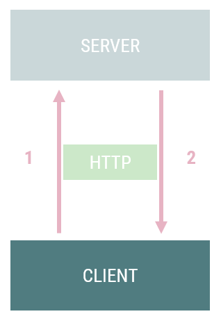
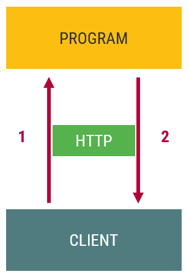
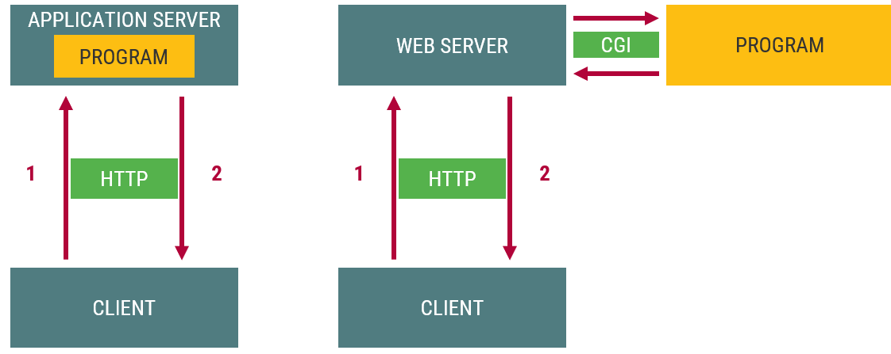
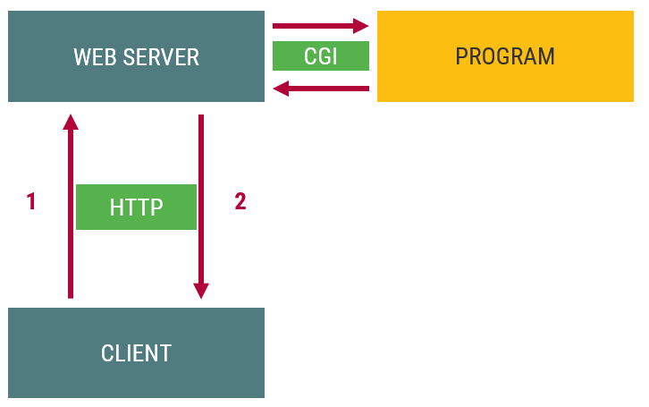

::: title
Webprogramozás
:::

### Szerveroldali programozás, HTTP, PHP

:::::: {.columns}
::: {.column width="33%"}
<small>
**Visnovitz Márton**  
egyetemi tanársegéd  
visnovitz.marton@inf.elte.hu
</small>
:::
::: {.column width="33%"}
<small>
**Horváth Győző**  
egyetemi docens  
horvath.gyozo@inf.elte.hu
</small>
:::
::::::

<small>
1117 Budapest, Pázmány Péter sétány 1/c., 2.408  
Tel: (1) 372-2500/8469\
</small>

------

## Szerveroldali dinamikus webprogramozás {data-state="new-section"}

------

## Világháló

A világháló (angolul **World Wide Web**, röviden **web**) egy olyan információs rendszer, amelyben 

- **dokumentumokat** és más erőforrásokat 
- **egységes címmel** azonosítunk, 
- ezeket **hiperhivatkozásokkal** kötjük össze, 
- elérhetőségüket **internetre kötött szerverek** segítségével biztosítjuk, 
- megtekintésük pedig speciális kliensprogramokban, **böngészőkben** történik.

------

## Web komponensei, szabványai

- [HTML](https://www.w3.org/html/) (dokumentumok, hiperhivatkozások)
- [URL](https://www.w3.org/TR/url/) (erőforrások egységes címe)
- webszerver (erőforrások elérhetővé tétele)
- webkliens, webböngésző (erőforrások megjelenítése)
- [HTTP](https://tools.ietf.org/html/rfc7230) (kliens-szerver kommunikáció)

[Webes szabványok](https://www.w3.org/TR/)

------

## Kliensoldali webprogramozás

:::::::::::::::::::: {.columns}
::: {.column style="width: 70%"}
Egy komponens

- Kliens-szerver architektúra
- Statikus/dinamikus kliens
- Nem érdekes a szerver, csak az onnan érkező tartalom
- Nem is kell szerver, dolgozhatunk lokálisan
- Programozás a böngészőben
- JavaScript, DOM, stb.
:::

::: {.column style="width: 30%"}

:::
::::::::::::::::::::

------

## Kliens-szerver architektúra

:::::::::::::::::::: {.columns}
::: {.column style="width: 70%"}
Több komponens

- **Szerver**
- Kliens
- HTTP (kommunikáció)

1. Kérés (request)
2. Válasz (response)
:::

::: {.column style="width: 30%"}

:::
::::::::::::::::::::

------

## Kliens-szerver architektúra

Térben és időben elválhatnak


------

## Statikus szerveroldali tartalom

:::::::::::::::::::: {.columns}
::: {.column style="width: 70%"}
Kérés pillanatában a szerveren megtalálható az a tartalom, amely leküldésre kerül a válaszban

- Fájlkiszolgálás
- Kiterjesztés alapján
  - `.html`
  - `.jpg`, `.png`, `.gif`
  - `.css`
  - `.js`
:::

::: {.column style="width: 30%"}

:::
::::::::::::::::::::

------

## Dinamikus szerveroldali tartalom

A leküldendő tartalmat egy program állítja elő.

:::::::::::::::::::: {.columns}
::: {.column style="width: 40%"}

:::
::::::::::::::::::::

------

## Architektúrák



------

## Szerveroldali webprogramozás

:::::::::::::::::::: {.columns}
::: {.column style="width: 50%"}
- Nem egyszerű fájlkiszolgálás
- Indítás
  + `cgi-bin` könyvtár
  + kiterjesztés (pl. `.cgi`, `.php`)
- Program
  + **bármilyen**
  + bináris (C++, Pascal)
  + script (PHP, Python, Ruby)
:::

::: {.column style="width: 50%"}

:::
::::::::::::::::::::

------

## Szerveroldali webprogramozás

- Program célja, kimenete
  - HTML generálás (általában)
  - Tartalom generálás (általánosan)
  - HTTP protokoll betartásával
- Program helyességét a generált tartalom, a megkapott oldal forrása alapján ellenőrizhetjük.

------

## URL, HTTP, CGI {data-state="new-section"}

------

## URL


[URL az MDN-en](https://developer.mozilla.org/en-US/docs/Learn/Common_questions/What_is_a_URL)

------

## HTTP protokoll

- Kérés-válasz alapú protokoll a kliens és szerver között
- Mindig a kliens kezdeményez
- Kliens: kérés
  - kérést küld a 80-as/443-as TCP portra
  - jellemzően böngésző (hivatkozások, formok)
- Szerver: válasz
- TCP/IP réteg feletti protokoll
- [Szabvány](http://tools.ietf.org/html/rfc2616)

------

## HTTP üzenetstruktúra

:::::: {.columns}
::: {.column style="width:40%"}
``` {style="font-size: 0.4em"}
POST / HTTP/1.1
Host: localhost:8000
User-Agent: Mozilla/5.0 (...)
Accept: text/html
Accept-Language: en-Us
Accept-Encoding: gzip, deflate
Connection: keep-alive
Content-Type: multipart/form-data
Content-Length: 345
✒>                <✒
-12656974
(more data... )
```
:::
::: {.column style="width:20%"}
``` {style="font-size: 0.4em; text-align: center"}
start-line


headers


blank
body
```
:::
::: {.column style="width:40%"}
``` {style="font-size: 0.4em"}
HTTP/1.1 403 Forbidden
Server: Apache
Content-Type: text/html;charset=utf-8
Date: Wed, 10 Aug 2016 09:23:25 GMT
Keep-Alive: timeout=5, max=1000
Connection: Keep-Alive
Age: 3465
X-Cache-Info: caching
Content-Length: 220
✒>                <✒
<!DOCTYPE html>
(more data...)
```
:::
::::::

[HTTP áttekintése](https://developer.mozilla.org/en-US/docs/Web/HTTP/Overview),
[HTTP üzenetstruktúra](https://developer.mozilla.org/en-US/docs/Web/HTTP/Messages),
[HTTP referencia](https://developer.mozilla.org/en-US/docs/Web/HTTP#Reference)

------

## HTTP kérés

```
METÓDUS ERŐFORRÁS VERZIÓ
FEJLÉC: ÉRTÉK
FEJLÉC: ÉRTÉK
FEJLÉC: ÉRTÉK

ÜZENETTEST (opcionális)
```

------

## HTTP metódusok

- `GET`: Megadott erőforrás letöltése
- `POST`: Feldolgozandó adat felküldése
- `DELETE`: Törli a megadott erőforrást
- `PATCH`: Adott erőforrás javítása, frissízsée
- `HEAD`: Ld. `GET`, de csak a válasz fejléceket kéri le
- `PUT`: Feltölti a megadott erőforrást
- `TRACE`: Visszaküldi a kapott kérést
- `OPTIONS`: A szerver által támogatott HTTP metódusok listája
- `CONNECT`: Kérést transzparens tunnellé alakítja (SSL)

------

## HTTP kérés példa

```txt
GET /index.html HTTP/1.1
Host: webprogramozas.inf.elte.hu

```
```txt
GET / HTTP/1.1
Host: webprogramozas.inf.elte.hu
User-Agent: Mozilla/5.0 (Windows NT 6.1; rv:19.0) Gecko/20100101 Firefox/19.0
Accept: text/html,application/xhtml+xml,application/xml;q=0.9,*/*;q=0.8
Accept-Language: hu-hu,hu;q=0.8,en-US;q=0.5,en;q=0.3
Accept-Encoding: gzip, deflate
Connection: keep-alive

```

------

## HTTP válasz

```txt
VERZIÓ STÁTUSZKÓD INDOKLÁS
FEJLÉC: ÉRTÉK
FEJLÉC: ÉRTÉK
FEJLÉC: ÉRTÉK

ÜZENETTEST (opcionális)
```

------

## HTTP státuszkódok

- `1xx`: Informatív (kérés megkapva)
- `2xx`: Siker (kérés megérkezett, elfogadva)
  - 200 OK
- `3xx`: Átirányítás (további műveletre van szükség)
- `4xx`: Kliens hiba (kérés hibás, nem teljesíthető)
  - 403 Forbidden
  - 404 Not found
- `5xx`: Szerver hiba (nem tudja teljesíteni a kérést)
  - 500 Internal Server Error

------

## HTTP válasz példa

```txt
HTTP/1.1 200 OK
Date: Wed, 03 Apr 2013 07:11:56 GMT
Server: Apache/2.2.10 (Linux/SUSE)
Last-Modified: Wed, 20 Feb 2013 08:39:44 GMT
ETag: "fe8438-6d6-4d623e65e9400"
Accept-Ranges: bytes
Content-Length: 1750
Content-Type: text/html

<!DOCTYPE html>
<html>
	...
</html>
```

------

## HTTP eszközök

Webfejlesztési eszköztár (`F12`) &rarr; Hálózat (Network) fül

------

## Common Gateway Interface (CGI)

Azt határozza meg, hogy egy webszerver hogyan *indíthat* el egy programot és milyen módon cserél *adatot* vele.

:::::::::::::::::::: {.columns}
::: {.column style="width: 60%"}
- Indítás: program futtatása
- Adatok 
  + környezeti változók
  + standard I/O
- **Program eredménye**
  + standard kimeneten
:::

::: {.column style="width: 40%"}

:::
::::::::::::::::::::

------

## Példa -- C++

```cpp
#include <iostream>
using namespace std;
int main()
{
    cout << "Content-Type: text/html" << endl;
    cout << endl;

    cout << "<!doctype html>" << endl;
    cout << "<html>" << endl;
    cout << "    <head>" << endl;
    cout << "        <meta charset=\"utf-8\">" << endl;
    cout << "        <title></title>" << endl;
    cout << "    </head>" << endl;
    cout << "    <body>" << endl;
    cout << "        <p>Hello vilag!</p>" << endl;
    cout << "    </body>" << endl;
    cout << "</html>" << endl;

    return 0;
}
```

------

## Példa -- C++

<div class="columns">
<div class="column" style="width: 50%">
- Parancssorból futtatva

```html
Content-Type: text/html

<!doctype html>
<html>
    <head>
        <meta charset="utf-8">
        <title></title>
    </head>
    <body>
        <p>Hello vilag!</p>
    </body>
</html>
```
</div>

<div class="column" style="width: 50%">
- Böngészőből futtatva

<div class="example" style="margin-top: 20px">
  <p>Hello vilag!</p>
</div>
</div>
</div>

------

## Példa -- C++

```cpp
int main()
{
    cout << "Content-Type: text/html" << endl;
    cout << endl;

    cout << "<!doctype html>" << endl;
    cout << "<html>" << endl;
    cout << "    <head>" << endl;
    cout << "        <meta charset=\"utf-8\">" << endl;
    cout << "        <title></title>" << endl;
    cout << "    </head>" << endl;
    cout << "    <body>" << endl;

    for (int i = 1; i <= 5; i++) {
        cout << "        <p>Hello vilag!</p>" << endl;
    }

    cout << "    </body>" << endl;
    cout << "</html>" << endl;
    return 0;
}
```

------

## Példa -- C++

:::::::::::::::::::: {.columns}
::: {.column style="width: 50%"}
```html
Content-Type: text/html

<!doctype html>
<html>
    <head>
        <meta charset="utf-8">
        <title></title>
    </head>
    <body>
        <p>Hello vilag!</p>
        <p>Hello vilag!</p>
        <p>Hello vilag!</p>
        <p>Hello vilag!</p>
        <p>Hello vilag!</p>
    </body>
</html>
```
:::

::: {.column style="width: 50%"}
<div class="example" style="margin-top: 20px">
  <p>Hello vilag!</p>
  <p>Hello vilag!</p>
  <p>Hello vilag!</p>
  <p>Hello vilag!</p>
  <p>Hello vilag!</p>
</div>
:::
::::::::::::::::::::

------

## PHP {data-state="new-section"}

------

## PHP a webprogramozásban

`http://szerver/peldak/pelda.php`


------

## PHP

- [PHP](http://www.php.net/) (7.4.4 -- 2020.03.19.)
  - Eredetileg: *Personal Home Page*
  - Ma: *PHP: Hypertext Preprocesszor*
- [Dokumentáció](http://www.php.net/manual/en/)
  - nyelvi és függvényreferencia, kódolási tanácsok
- Jellemzői
  - nyílt forráskódú
  - általános célú
  - szkriptnyelv
  - HTML-be ágyazható

------

## PHP használata

- Szerveroldali dinamikus webprogramozás
  + weboldalak generálása

  ```txt
  http://szerver/peldak/pelda.php
  ```

- CLI -- Command Line Interface
  + PHP scriptek parancssori futtatása

  ```txt
  > php pelda.php
  ```

------

## JavaScript vs PHP

:::::::::::::::::::: {.columns}
::: {.column style="width: 50%"}
```js
// declaration 
const x = [1, 3, 5, 7, 9];
let s;
// process 
s = 0;
for(let i=0; i<x.length; i++) {
  s = s + x[i];
}
// output 
console.log('Sum: ',  s)
```
:::

::: {.column style="width: 50%"}
```php
// declaration 
$x = [1, 3, 5, 7, 9];

// process 
$s = 0;
for($i=0; $i<count($x); $i++) {
    $s = $s + $x[$i];
}
// output 
echo 'Sum: ', $s;
```
:::
::::::::::::::::::::

Változók neve `$` jellel kezdődik.

------

## PHP mint programozási nyelv

:::::::::::::::::::: {.columns}
::: {.column style="width: 50%"}
- Dinamikusan típusos
  + változók típusa a benne tárolt értéktől függ
  + automatikus típuskonverziók
- Értelmezett
- Szkriptnyelv
:::

::: {.column style="width: 50%"}
- Részben case sensitive
- Utasítások végén `;`
- Többparadigmás nyelv
  + procedurális
  + OOP
  + funkcionális
- C alapú szintaxis
- Nincs főprogram
:::
::::::::::::::::::::

- Hasonló a JavaScripthez
  + szintaxis
  + vezérlési szerkezetek, operátorok
  + viselkedés

------

## Megjegyzések

```php
// egysoros megjegyzés

#  Perl szintaktikájú egysoros megjegyzés

/*
többsoros
megjegyzés
*/
```

------

## Típusok

:::::::::::::::::::: {.columns}
::: {.column style="width: 50%"}
- Egyszerű típusok
  + logikai (`bool`)
  + egész (`int`)
  + lebegőpontos (`float`)
  + szöveg (`string`)
:::

::: {.column style="width: 50%"}
- Összetett típusok
    + tömb (`array`)
    + objektum (`object`)
    + függvény (`callable`)
- Speciális típusok
    + erőforrás
    + `NULL`
:::
::::::::::::::::::::

------

## Literálok

:::::::::::::::::::: {.columns}
::: {.column style="width: 40%"}
```php
//Logikai
true
false

//Egész
12     //decimális
-34
0123   //oktális
0x0F   //hexadecimális
0b0101 //bináris

//Lebegőpontos
3.1415
5.6e12
-7E-2
```
:::

::: {.column style="width: 60%"}
```php
$a = 12;
// Aposztróf: nem helyettesít be
'alma\t${a} alma' // alma\t{$a} alma
'Több
sor is lehet benne'

// Macskaköröm: behelyettesít
"alma\t${a} alma" // alma   12 alma
"Ez egy
több soros szöveg"

// Heredoc: behelyettesít
<<<EOT
Több soros {$a}
szöveg
EOT

// Nowdoc: nem helyettesít be
<<<'EOT'
Ez is lehet {$a}
több soros.
EOT
```
:::
::::::::::::::::::::

------

## Típusokkal kapcsolatos fontos függvények

:::::::::::::::::::: {.columns}
::: {.column style="width: 50%"}
- Típusbeállítás
  + típuskényszerítés `(int)$a`
  + `settype()`

```php
$a = '12';
gettype($a);  // 'string'
$a = (int)$a; // cast to int
gettype($a);  // 'integer'
```
:::

::: {.column style="width: 50%"}
- Típuslekérdezés
    + `gettype()`
    + `is_integer()`
    + `is_float()`
    + `is_numeric()`
    + `is_string()`
    + `is_bool()`
    + …
:::
::::::::::::::::::::

:::::::::::::::::::: {.columns}
::: {.column style="width: 50%"}
- Speciális függvények
    + `isset()`
    + `is_null()`
    + `empty()`
:::

::: {.column style="width: 50%"}
- [Automatikus konverziók](http://www.php.net/manual/en/language.types.type-juggling.php)
- [Típusok összehasonlítása (táblázatok)](http://www.php.net/manual/en/types.comparisons.php)
:::
::::::::::::::::::::

------

## Operátorok

- [Referencia](http://php.net/manual/en/language.operators.php)
- Kb. ugyanaz, mint JavaScriptben
- Különbség
  + `+` kizárólag összeadás
  + `.` szövegösszefűzés
- Újdonság
  + `$a <=> $b`: összehasonlítás (-1, 0, 1)
  + `$a ?? $b ?? $c`: az első nem `NULL`
  + `$a ?: $b`: megegyezik `$a ? $a : $b`

:::::::::::::::::::: {.columns}
::: {.column}
```php
"piros " + "alma"; // 0
"piros " . "alma"; // "piros alma"
```
:::

::: {.column}
```php
1 <=> 1; // 0
1 <=> 2; // -1
2 <=> 1; // 1

NULL ?? 1 ?? 2; // 1

false ?: 'alma'; // 'alma'
```
:::
::::::::::::::::::::

------

## Vezérlési szerkezetek

Ld. C++ vagy JavaScript

Továbbá:

```php
foreach ($tomb as $ertek) {
  utasítások;
}

foreach ($tomb as $kulcs => $ertek) {
  utasítások;
}
```

------

## Függvények {data-state="new-section"}

------

## Függvények

```cpp
// C++
int add(int a, int b) {
  return a + b;
}
```
```js
// JavaScript
function add(a, b) {
  return a + b;
}
```
```php
// PHP
function add($a, $b) {
  return $a + $b;
}
// or
function add(int $a, int $b): int {
  return $a + $b;
}
```

------

## Függvények

```php
// Default value
function greet($name = 'somebody') {
  return "Hello ${name}!";
}
greet();    // "Hello somebody!"

// Pass by reference
$szam = 41;
function novel(&$szam) {
  $szam += 1;
}
novel($szam);
print($szam);    // 42

// Anonymous function literal
$add = function ($a, $b) {
  return $a + $b;
}
print($add(10, 32)); // 42

// Accessing global scope
$globus = 'Föld';
function zartFuggveny() {
  global $globus;
  print("Gyönyörű a ${globus}!");
}
// or
function zartFuggveny() {
  print("Gyönyörű a ${GLOBALS['globus']}!");
}
// or, accessing just the parent scope
$zartFuggveny = function () use ($globus) {
  print("Gyönyörű a ${globus}!");
}
```

------

## Típusannotációk

```php
// Szigorú típusosság
declare(strict_types=1);

function add(int $a, int $b): int {
    return $a + $b;
}

var_dump(add(1, 2));
var_dump(add(1.5, 2.5)); // Hibát dob

// Gyenge típusosságnál automatikus konverziók történnek
function sum(int $a, int $b) {
    return $a + $b;
}

var_dump(sum(1.5, 2.5)); // 3
```

------

## Tömb {data-state="new-section"}

------

## Tömb

- Gyűjtemények általános objektuma
- Asszociatív tömb: kulcs-érték párokból áll
  + kulcs: `integer` vagy `string`
  + érték: bármilyen típusú lehet
- Összetett adatszerkezet megvalósítása
  + rekord
  + indexelt tömb
  + asszociatív tömb
  + többdimenziós tömb
  + fa, sor, verem, stb.

------

## Tömb

```php
// Üres tömb
$arr = array();
// vagy
$arr = [];

// Indexelt tömb létrehozása
$arr = array('alma', 'korte', 'szilva');
// vagy
$arr = ['alma', 'korte', 'szilva'];

// A tömb hosszának lekérdezése
count($arr);	// => 3

// Hivatkozás
$arr[0]; //'alma'

// Elemek módosítása
$arr[1] = 13;
$arr[1];		//13

// Új elem beszúrása a tömb végére
$arr[] = 'új';

// Elem törlése
unset($arr[1]);

// Mátrix: tömbök tömbje
$matrix = [
  [1, 2, 3],
  [4, 5, 6],
  [7, 8, 9],
);

// Index beállítása
$other = [ 1 => 'alma', 'korte', 'szilva'];
```

------

## Asszociatív tömb

```php
// Asszociatív tömb
$asszTomb = array(
  'alma'    => 'piros',
  'korte'   => 'sarga',
  'szilva'  => 'kek',
);
// vagy
$asszTomb = [
  'alma'    => 'piros',
  'korte'   => 'sarga',
  'szilva'  => 'kek',
];


// Hivatkozás
$asszTomb['alma']; //piros
```

------

## Tömbök bejárása

- `foreach`
- `reset()`, `next()`, `prev()`, `current()`, `key()`, `each()`

```php
$gyumolcsok = [
  'alma'    => 'piros',
  'korte'   => 'sárga',
  'szilva'  => 'kék',
];

// foreach
foreach ($gyumolcsok as $gyumolcs => $szin) {
	print("${szin} ${gyumolcs}\n");
}
/*
piros alma
sárga korte
kék szilva
*/

//tömbműveletekkel
reset($gyumolcsok);
while (list($kulcs, $ertek) = each($gyumolcsok)) {
  print("${ertek} ${kulcs}\n");
}
```

------

## Összegzés tétel

```php
function osszegzes($tomb) {
  $s = 0;
  foreach ($tomb as $szam) {
    $s = $s + $szam;
  }
  return $s;
}

$x = [1, 3, -2, 8];
$result = osszegzes($x);
```

------

## Eldöntés tétel

```php
function eldontes(array $tomb, callable $fn): bool {
  $i = 0;
  while ($i < count($tomb) && !$fn($tomb[$i])) {
    $i += 1;
  }
  return $i < count($tomb);
}
// or
function eldontes(array $tomb, callable $fn): bool {
  reset($tomb);
  while ((list(, $e) = each($tomb)) && !$fn($e)) { }
  return $e !== NULL;
}

$x = [1, 3, -2, 8];
$result = eldontes($x, function($e) { return $e < 0; });
```

------

## Adatszerkezetek

:::::::::::::::::::: {.columns}
::: {.column style="width: 40%"}
Tömb

```php
$kutyuk = [
  'telefon',
  'fülhallgató',
  'pendrive',
  'e-könyv olvasó',
];
```
:::

::: {.column style="width: 60%"}
Rekord

```php
$hallgato = [
  'nev'     => 'Mosolygó Napsugár',
  'neptun'  => 'kod123',
  'szak'    => 'Informatika BSc',
];
```
:::
::::::::::::::::::::

------

## Adatszerkezetek

```php
// Rekordok tömbje
$hallgatok = [
  [
    'nev'     => 'Mosolygó Napsugár',
    'neptun'  => 'kod123',
    'szak'    => 'Informatika BSc',
  ],
  [
    'nev'     => 'Kék Ibolya',
    'neptun'  => 'kod456',
    'szak'    => 'Informatika BSc',
  ],
];
```

------

## Adatszerkezetek

```php
// Rekordok tömbje
$hallgatok = [
  [
    'nev'    => 'Mosolygó Napsugár',
    'neptun'  => 'kod123',
    'szak'    => 'Informatika BSc',
    'targyak'  => [
      'Programozás',
      'Webfejlesztés 2.',
      'Számítógépes alapismeretek',
    ],
  ],
  [
    'nev'    => 'Kék Ibolya',
    'neptun'  => 'kod456',
    'szak'    => 'Informatika BSc',
    'targyak'  => [
      'Programozás',
      'Webfejlesztés 2.',
      'Diszkrét matematika',
      'Testnevelés',
    ],
  ],
];
```

------

## Osztályok {data-state="new-section"}

Klasszikus OOP

------

## Osztályok létrehozása

```php
class Gyerek {
  public $kor;
  public $nev;

  public function __construct($nev, $kor) {
    $this->nev = $nev;
    $this->kor = $kor;
  }

  public function bemutatkozik() {
    print("A nevem: {$this->nev}\n");
  }
}
```

------

## Objektum példányosítása

```php
$zsofi = new Gyerek('Zsófia', 7);
$matyi = new Gyerek('Mátyás', 2);

$zsofi->bemutatkozik();
$matyi->bemutatkozik();

$zsofi->nev = 'Zsozsó';
$zsofi->bemutatkozik();
```

```txt
A nevem: Zsófia
A nevem: Mátyás
A nevem: Zsozsó
```

------

## Getterek és setterek

:::::::::::::::::::: {.columns}
::: {.column style="width: 45%"}
```php
class Gyerek {
  private $kor;
  private $nev;
  public function __construct($nev, $kor) {
    $this->nev = $nev;
    $this->kor = $kor;
  }
  public function getNev() {
    return $this->nev;
  }
  public function setNev($value) {
    $this->nev = $value;
  }  
  public function getKor() {
    return $this->kor;
  }
  public function setKor($value) {
    $this->kor = $value;
  }  
  public function bemutatkozik() { /*...*/ }
}
```
:::

::: {.column style="55%"}
```php
$sari = new Gyerek('Sári', 7);
$sari->bemutatkozik();

$sari->setNev('Sarah');
$sari->bemutatkozik();
```

```txt
A nevem: Sári
A nevem: Sarah
```
:::
::::::::::::::::::::

------

## Öröklés

:::::::::::::::::::: {.columns}
::: {.column}
```php
class Ovodas extends Gyerek {
  private $jel;

  public function __construct($nev, $kor, $jel) {
    parent::__construct($nev, $kor);
    $this->jel = $jel;
  }

  public function getJel() {
    return $this->jel;
  }

  public function setJel($value) {
    $this->jel = $value;
  }

  public function miAJeled() {
    print("A jelem: {$this->jel}\n");
  }
}
```
:::

::: {.column}
```php
$zsofi = new Gyerek('Zsófia',7);
$zsofi->bemutatkozik();

$david = new Ovodas('Dávid',4,'perec');
$david->bemutatkozik();
$david->miAJeled();
```
```txt
A nevem: Zsófia
A nevem: Dávid
A jelem: perec
```
:::
::::::::::::::::::::

------

## További OOP tulajdonságok

- osztályok (`class`),
- láthatóság szabályozása (`public`, `protected`, `private`),
- konstruktorok, destruktorok (`__construct`, `__destruct`),
- statikus adattagok és metódusok (`static`),
- absztrakt osztályok (`abstract`),
- interfészek (`interface`),
- öröklés (`extends`),
- "magic" metódusok (`__get`, `__set`, stb)
- stb.

------

## Kimenet generálása {data-state="new-section"}

------

## PHP fájl

- `.php` kiterjesztésű fájl
- `<?php` és `?>` tagek közötti rész kerül értelmezésre
- Több PHP blokk is lehet
- Ezeken kívüli rész automatikusan kiírásra kerül
- Kiírás PHP blokkon belül
  + `echo`, `print` (függvény vagy kulcsszó)
  + `var_dump()`, `print_r()` (debugolás)

:::::::::::::::::::: {.columns}
::: {.column}
```php
<?php
//PHP kód
?>
Szöveg
<?php
//PHP kód
?>
```
:::

::: {.column}
```php
<p>Bekezdés</p>
<?php
$nev = 'Alma';
echo "<p>${nev}</p>";
echo("<p>${nev}</p>");
print "<p>${nev}</p>";
print("<p>${nev}</p>");
?>
<p>Bekezdés</p>
```
:::
::::::::::::::::::::

------

## Elvek

- Cél: HTML előállítása programmal
- PHP fájl logikai részei
  + beolvasás
  + feldolgozás: adat előkészítése
  + **kiírás**: HTML előállítása az adatból
- Adat és nézet szétválasztása
- Statikus prototípus → Dinamikus sablon
- Csak a dinamikus részekhez használjunk PHP-t!
- PHP alternatív szintaxisa (sablonnyelv)

------

## Példa

Adott hibaüzenetek sorozata. Jelenítsük ezt meg felsorolásként!

------

## Példa

:::::::::::::::::::: {.columns}
::: {.column style="width: 40%"}
Adat

```php
$errors = [
  'error1',
  'error2',
  'error3',
];
```

Statikus prototípus

```html
<ul>
  <li>error1</li>
  <li>error2</li>
  <li>error3</li>
</ul>
```
:::

::: {.column style="width: 60%"}
Dinamikus sablon

```php
echo "<ul>";
foreach($errors as $error) {
  echo "  <li>${error}</li>";
}
echo "</ul>";
```
```php
<ul>
<?php foreach($errors as $error) { ?>
    <li><?php echo $error ?></li>
<?php } ?>
</ul>
```
```php
<ul>
<?php foreach($errors as $error) : ?>
    <li><?= $error ?></li>
<?php endforeach ?>
</ul>
```
:::
::::::::::::::::::::

------

## Alternatív szintaxis (sablonnyelv)

```php
<!-- Kiírás -->
<?= $valtozo ?>

<!-- Elágazás -->
<?php if (felt) : ?>
    HTML sablon kód
<?php else : ?>
    HTML sablon kód
<?php endif ?>

<!-- Ciklus -->
<?php foreach($arr as $e) : ?>
    HTML sablon kód
<?php endforeach ?>
```

------

## Összefoglalás {data-state="topic"}

- [x] Cél: HTML kódot előállítása
- [x] HTTP, CGI
- [x] PHP hasonlít a JavaScripthez, néhány különbség  
      (pl. `$` jeleket kell írni)
- [x] Kimenet generálás: PHP csak a dinamikus tartalomhoz
