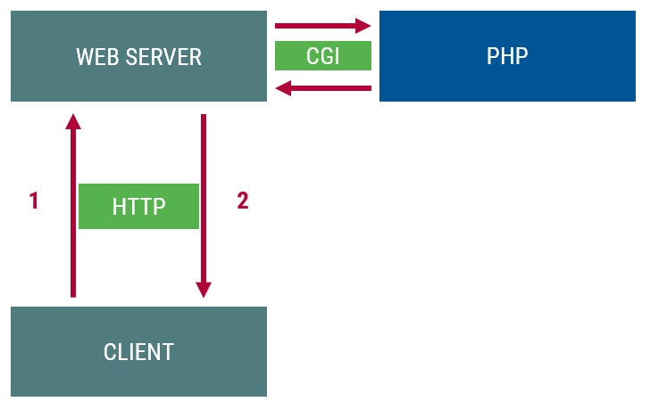
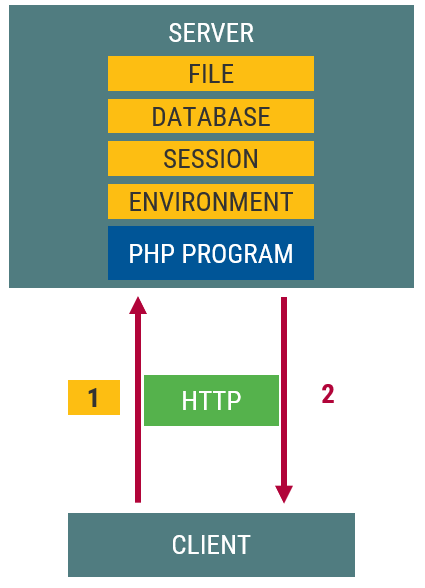
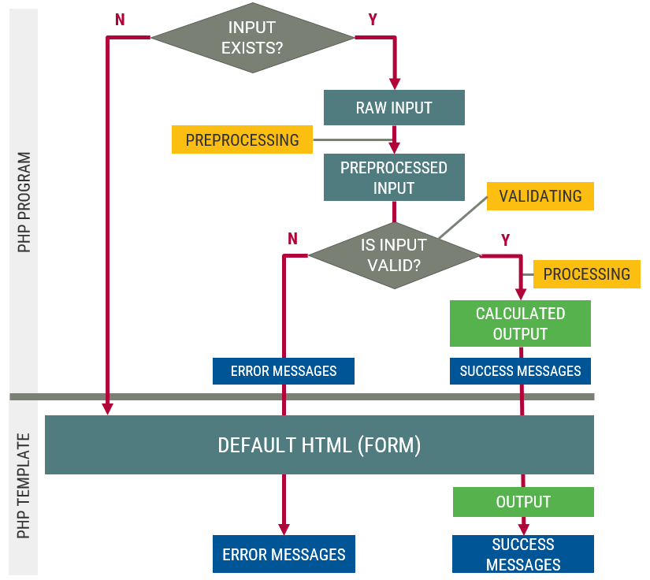
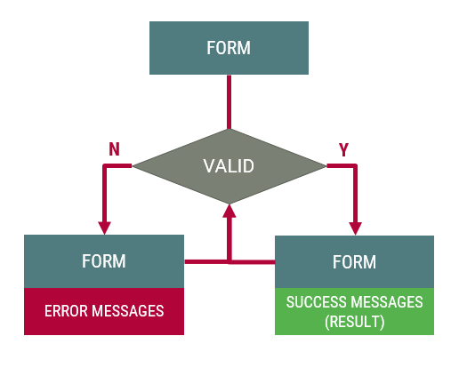
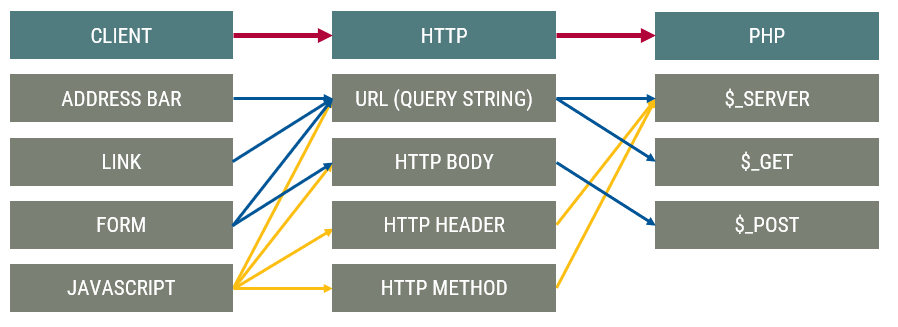

::: title
Webprogramozás
:::

### Bemenet, űrlapfeldolgozás

:::::: {.columns}
::: {.column width="33%"}
<small>
**Visnovitz Márton**  
egyetemi tanársegéd  
visnovitz.marton@inf.elte.hu
</small>
:::
::: {.column width="33%"}
<small>
**Horváth Győző**  
egyetemi docens  
horvath.gyozo@inf.elte.hu
</small>
:::
::::::

------

## Ismétlés {data-state="new-section"}

------

## Ismétlés

Dinamikus szerveroldali webprogramozás: program állítja elő a tartalmat (HTML)

:::::::::::::::::::: {.columns}
::: {.column style="width: 50%"}
- [X] PHP nyelv
  - Adatszerkezetek
  - Programozási tételek
- [X] Program szerkezete
  - beolvasás
  - feldolgozás
  - **kiírás**
- [X] Kimenet (HTML)
  - dinamikus **sablon**
  - alternatív szintaxis
:::

::: {.column style="width: 50%"}

:::
::::::::::::::::::::

------

## Ismétlés

```php
<?php 
// Input (?)
$tracks = [
  ["id" => 1, "name" => "guitar", "muted" => false],
  ["id" => 2, "name" => "bass",   "muted" => true ],
  ["id" => 3, "name" => "vocal",  "muted" => false],
];

// Processing
$enabledTracks = array_filter($tracks, function ($track) {
  return !$track["muted"];
});
?>
```
```html
<!-- Output -->
<div id="tracks">
  <?php foreach($enabledTracks as $t) : ?>
    <div class="track">
      <?= $t["name"] ?>
    </div>
  <?php endforeach ?>
</div>
```

------

## Szerveroldali program bemeneti adatai {data-state="new-section"}

------

## Szerveroldali program bemeneti adatai

A bemeneti program lehetséges forrásai:

- [ ] **Kliens**
- [ ] Környezet
- [ ] Fájl
- [ ] Munkamenet
- [ ] Adatbázis
- [ ] Másik szerver

------

## Szerveroldali program bemeneti adatai



------

## Kliensről érkező adatok


------

## Kérésindítási lehetőségek

- [ ] **Cím (URL) beírása (`GET`)**
- [ ] **Linkre kattintás (`GET`)**
- [ ] Űrlap elküldése (`GET`, `POST`)
- [ ] JavaScript (`GET`, `POST`, ...)
  - oldal újratöltés - `window.location` (`GET`)
  - űrlap elküldés - `submit()` metódus (`GET`, `POST`)
  - AJAX/fetch kérés (bármilyen HTTP metódus)

------

## Cím (URL) beírása / Linkre kattintás

```txt
<protocol>://<host>:<port>/<path>?✒><query><✒#<fragment>
```

**Példa**

```html
<a href="http://server.hu/index.php?✒>adat=ELTE<✒">Valami</a>
```

------

## Adat a címsorban

- A `?`-et követő név-érték párok sorozata
- `&` jellel elválasztva
  - `foo=1&bar=2`
- Szükség esetén "URL encoding"
  - `urlencode("Tom & Jerry");`
  - `title=Tom+%26+Jerry"`
- A HTTP kérés nyitó sorában továbbítjuk

```
GET /index.php✒>?title=Tom+%26+Jerry<✒ HTTP/1.1
Host: webprogramozas.inf.elte.hu
```

------

## Feldolgozás PHP-ban

- Környezeti változókon (`$_SERVER`) keresztül
  - `$_SERVER["QUERY_STRING"]`
- A `$_GET` *szuperglobális* változón keresztül
  - a PHP előre felparseolja
  - asszociatív tömbként hozzáférhető
  - pl: `$_GET["title"]`

------

## Feldolgozás példa

```php
<?php

$title = $_GET["title"] ?? "I don't know";

?>
<h1>Title: <?= $name ?></h1>
```

------

## Kérésindítási lehetőségek

- [X] Cím (URL) beírása (`GET`)
- [X] Linkre kattintás (`GET`)
- [ ] **Űrlap elküldése (`GET`, `POST`)**
- [ ] JavaScript (`GET`, `POST`, ...)
  - oldal újratöltés - `window.location` (`GET`)
  - űrlap elküldés - `submit()` metódus (`GET`, `POST`)
  - AJAX/fetch kérés (bármilyen HTTP metódus)

------

## Űrlap elküldése: a `<form>` elem

- Attribútumok
    + `action`: szerveroldali erőforrás megjelölése
    + `method`: HTTP metódus (`GET` vagy `POST`)
    + `enctype`: a form-adatok kódolása a küldés során
- `enctype`
    + `application/x-www-form-urlencoded` (alapértelmezett)
    + `multipart/form-data` (fájlfeltöltés, csak `POST` esetén)
    + `text/plain` (levélküldés)

```html
<form method="get" action="index.php">
  <label for="title">
  <input type="text" id="title" name="title">
  <button type="submit">Send</button>
</form>
```

------

## Űrlap elküldése

- Elküldés
  - a type `submit` gomb megnyomása
  - JavaScript: `form.submit()` meghívása
- [Lépések](http://www.w3.org/TR/REC-html40/interact/forms.html#h-17.13)
  1. Elküldhető elemek kiválasztása
  2. Kérési adatok összeállítása
  3. Kérési adatok kódolása
  4. A kódolt kérési adatok elküldése
  
------

## Űrlap elküldése

1. Elküldhető elemek kiválasztása
    + van `name` attribútum
    + nem `disabled`
    + bejelölt checkbox
    + bejelölt radio
    + kiválasztott select

------

## Űrlap elküldése

2. Kérési adatok összeállítása
    + Elküldhető formelemekből `név=érték` párokat készít
    + ezeket `&` jellel fűzi össze
    + `name=Győző&pwd=secret&check1=value1&check2=on`
3. Kérési adatok kódolása
    + ld. `enctype` attribútum
    + `name=Gy%C5%91z%C5%91&pwd=secret&check1=value1&check2=on`
    + → Kérésszöveg (Query String)

------

## Űrlap elküldése

4. A kódolt kérési adatok elküldése
    - **GET**
      - URL: `action-url` + `?` + `query-string` (ld. korábban)
      - URL mérete limitált a gyakorlatban (2 kB)
    - **POST**
      - a HTTP kérés **üzenettörzs**ében utazik a kérésszöveg
      - sok adat küldhető

------

## `GET`/`POST` HTTP kérések

`GET` kérés

```html
METÓDUS /<path>?✒><query><✒ VERZIÓ
Host: <host>
FEJLÉC: ÉRTÉK
...
```

`POST` kérés

```html
METÓDUS /<path>?✒><query><✒ VERZIÓ
Host: <host>
FEJLÉC: ÉRTÉK
FEJLÉC: ÉRTÉK
FEJLÉC: ÉRTÉK

✒>ÜZENETTEST<✒
```

------

## Űrlap elküldése -- példa

Űrlap:

```html
<form action="http://host/page.php" method="post">
  <input type="text" name="foo" value="bar">
  <input type="password" value="secret">
  <input type="hidden" name="password" value="secret">
  <input type="checkbox" name="check1" value="baz" checked>
  <input type="checkbox" name="check2" checked>
  <button type="submit">Submit</button>
</form>
```

Kérésszöveg (Query string)

```txt
foo=bar&password=secret&check1=baz&check2=on
```

------

## Űrlapelemek

- Szöveges elemek
  - `<input>` type: `text`, `password`, `hidden`
  - `<textarea>`
  - mindig elküldésre kerülnek
  - akár üres szöveggel is
  - `textarea`-nál vigyázni kell: minden elküldésre kerül, ami a `<textarea></textarea>` elem között van

------

## Űrlapelemek

- `checkbox`, `radio`
  - csak bejelölve kerül elküldésre
  - ha nincs `value` → `on` érték
- `select`
  - ha nincs `value` → `option` szövege az érték
  - `size`>1 esetén ha nincs kiválasztva → nem küldi el
  - `multiple` esetén → ugyanazon névvel több név=érték pár (pl. `sel=foo&sel=bar`)

------

## Űrlapelemek

- `button`/`submit`
  - ha van neve → elküldésre kerül az értékével (felirat)
- `file`
  - `enctype="multipart/form-data"`
  - `method="POST"`
- `hidden`
  - nem lehet a `value` értéket megváltoztatni

------

## Feldolgozás PHP-ban

- `method="get"` esetén ugyanúgy, mint a  
  link/URL esetén a `$_GET` tömbön keresztül
- `method="post"` esetén a `$_POST` szuperglobális  
  változón (tömb) keresztül

------

## Feldolgozás általános séma



------

## Példa: négyzetgyök kiszámítása

Kérjünk be egy számot és írjuk ki a négyzetgyökét!

------

## Beolvasás, (elő)feldolgozás

```php
<?php
$errors = [];
// Input, process
if (isset($_POST["number"])) {
  // Reading, preprocessing
  $number = (int)$_POST["number"];

  // Validating
  if ($number < 0) {
    $errors[] = "The number is negative";
  }

  // Processing if there were no errors
  if (empty($errors)) {
    $square_root = sqrt($number);
  }
}

?>
```

------

## Kiírás

```html
<!-- HTML form -->
<form method="post">
  <input type="number" name="number">
  <button type="submit">Send</button>
</form>

<!-- Output result -->
<?php if (isset($square_root)): ?>
  <output>
    The square root of <?= $number ?> is <?= $square_root ?>
  </output>
<?php endif; ?>

<!-- Output errors -->
<?php foreach($errors as $error): ?>
  <div class="error"><?= $error ?></div>
<?php endforeach; ?>

```

------

## Több bemenet

Pl. regisztráció

```php
if (isset($_POST["username"]) && isset($_POST["password"]) && $_POST["email"] /* && ...*/) {
  /* Processing */
}
```

------

## Több bemenet

Helyette

```php
if (verify_post("username", "password", "email", "fullname")) {
  /* Processing */
}
```

------

## Bemenet megléte: `verify_*`

```php
function verify_post(...$inputs) {
  foreach ($inputs as $input) {
    if (!isset($_POST["input"])) {
      return FALSE;
    }
  }

  return TRUE;
}
```

```php
function verify_get(...$inputs) {
  foreach ($inputs as $input) {
    if (!isset($_GET["input"])) {
      return FALSE;
    }
  }

  return TRUE;
}
```

------

## Használat

```php
<?php

if (verify_post("username", "password")) {
  $username = $_POST["username"];
  $password = $_POST["password"];
  /* check credentials */
}

?>
```

```html
<form method="post" action="login.php">
  <label for="username">Username: </label>
  <input type="text" id="username" name="username">
  <label for="password">Password: </label>
  <input type="password" id="password" name="password">
  <button type="submit">Log in</button>
</form>
```

------

## Bemenet megléte: "clean" megoldás

```php
function array_all_keys_exist($array, $inputs) {
  foreach ($inputs as $input) {
    if (!isset($array["input"])) {
      return FALSE;
    }
  }

  return TRUE;
}

function verify_get(...$inputs) {
  return array_all_keys_exist($inputs);
}

function verify_post(...$inputs) {
  return array_all_keys_exist($inputs);
}
```

------

## Validáció: `filter_*()`

`filter_var()` és `filter_var_array()`

[Dokumentáció](http://php.net/manual/en/book.filter.php)

```php
// is_numeric helyett
if (!filter_var($input['sugar'], FILTER_VALIDATE_FLOAT)) {
  $errors[] = 'A sugár nem szám!';
}

// Összetettebb: szűrés és validálás
$email = filter_var($_POST['email'], FILTER_SANITIZE_EMAIL);
if (!filter_var($email, FILTER_VALIDATE_EMAIL)) {
  $errors[] = "Nem jó e-mail formátum!"; 
}

// Opciók
filter_var($string, FILTER_VALIDATE_REGEXP, [
  "options"=>[
    "regexp"=>"/^M(.*)/",
  ]
]);
```

------

## PHP filterek

- `FILTER_DEFAULT` (szöveg)
- `FILTER_VALIDATE_BOOLEAN`
- `FILTER_VALIDATE_EMAIL`
- `FILTER_VALIDATE_FLOAT`
- `FILTER_VALIDATE_INT`
- `FILTER_VALIDATE_IP`
- `FILTER_VALIDATE_MAC`
- `FILTER_VALIDATE_REGEXP`
- `FILTER_VALIDATE_URL`

------

## Hibák, üzenetek kezelése rekordokkal

```php
$messages = [];

if (/* ERROR */) {
  $messages = [
    "type" => "error",
    "message" => "ERROR MESSAGE"
  ];
}

if (/* SUCCESS */) {
  $messages = [
    "type" => "success",
    "message" => "SUCCESS MESSAGE"
  ];
}
```

------

## Hibák, üzenetek kezelése objektumokkal

```php
abstract class Message {
  public $type;
  public $message;

  public function __construct($type, $message) {
    $this->type = $type;
    $this->message = $message;
  }
}

class ErrorMessage extends Message {
  public function __construct($message) {
    parent::__construct("error", $message);
  }
}

class SuccessMessage extends Message {
  public function __construct($message) {
    parent::__construct("success", $message);
  }
}
```

------

## Hibák, üzenetek kezelése objektumokkal

```php
$messages = [];

if (/* ERROR */) {
  $messages[] = new ErrorMessage("ERROR MESSAGE");
}

if (/* SUCCESS */) {
  $messages[] = new SuccessMessage("SUCCESS MESSAGE");
}
```

```html
<?php foreach($messages as $message) : ?>
  <div class="<?= $message->type ?>"><?= $error->message ?></div>
<?php endforeach; ?>
```

------

## Általános feldolgozási logika

```php
// Array for errors
$messages = [];

// Check for input
if (verify_post("number")) {
  // Read (and preprocess input)
  $number = $_POST["number"];

  // Validate input
  if (!filter_var($number, FILTER_VALIDATE_FLOAT, ["min_range" => 0])) {
    $messages[] = new ErrorMessage("Invalid input number");
  }

  // Process if there were no errors
  if (empty($errors)) {
    $square_root = sqrt($number);
    $messages[] = new SuccessMessage("Calculation complete");
  }
}
```

------

## Üzenetek kiírása (rekordokkal)

```html
<?php if ($messages) : ?>
  <ul>
    <?php foreach($messages as $message) : ?>
      <li class="✒><?= $message['type'] ?><✒">
        <?= ✒>$message['message']<✒ ?>
      </li>
    <?php endforeach; ?>
  </ul>
<?php endif; ?>
```

VAGY

```html
<?php foreach($messages as $message) : ?>
  <div class="<?= ✒>$message['type']<✒ ?>">
    <?= ✒>$message['message']<✒ ?>
  </div>
<?php endforeach; ?>
```

------

## Üzenetek kiírása (objektumokkal)

```html
<?php if ($messages) : ?>
  <ul>
    <?php foreach($messages as $message) : ?>
      <li class="<?= ✒>$message->type<✒ ?>">
        <?= ✒>$message->message<✒ ?>
      </li>
    <?php endforeach; ?>
  </ul>
<?php endif; ?>
```

VAGY

```html
<?php foreach($messages as $message) : ?>
  <li class="<?= ✒>$message->type<✒ ?>">
    <?= ✒>$message->message<✒ ?>
  </li>
<?php endforeach; ?>
```

------

## Kérésindítási lehetőségek

- [X] Cím (URL) beírása (`GET`)
- [X] Linkre kattintás (`GET`)
- [X] Űrlap elküldése (`GET`, `POST`)
- [ ] **JavaScript (`GET`, `POST`, ...)**
  - oldal újratöltés - `window.location` (`GET`)
  - űrlap elküldés - `submit()` metódus (`GET`, `POST`)
  - AJAX/fetch kérés (bármilyen HTTP metódus)

------

## Lehetőségek JavaScripttel

Oldal újratöltése programozottan (`GET`)

```js
window.location = "http://example.com?✒>name=value<✒";
```

Űrlap elküldése programozottan (`GET`, `POST`)

```js
const form = document.querySelector("form");
✒>form.submit()<✒;
```

AJAX/fetch kérés küldése szervernek

```js
async function () {
  const formData = new FormData();
  formData.append("name", "value");

  const response = fetch("http://example.com?✒>name=value<✒", {
    ✒>method: "POST"<✒,
    ✒>body: formData<✒
  })
}
```

------

## Kérésindítási lehetőségek

- [X] Cím (URL) beírása (`GET`)
- [X] Linkre kattintás (`GET`)
- [X] Űrlap elküldése (`GET`, `POST`)
- [X] JavaScript (`GET`, `POST`, ...)
  - oldal újratöltés - `window.location` (`GET`)
  - űrlap elküldés - `submit()` metódus (`GET`, `POST`)
  - AJAX/fetch kérés (bármilyen HTTP metódus)

------

## Tervezés -- oldalak



------

## Ergonómiai megfontolások

- Hiba esetén: 
  - [X] Az alkalmazás funkcionálisan teljesíti az elvárásokat
  - [X] Látszanak a hibaüzenetek
  - [ ] Felhasználó látja, mit írt be, tud javítani
  - [ ] Ott látja a hibát, ahol az előfordult
- Siker esetén:
  - [X] Az alkalmazás funkcionálisan teljesíti az elvárásokat
  - [X] Látszanak az eredmény/sikeresség
  - [ ] Látszik, hogy mi volt a bemenet

------

## Űrlap állapottartása

Ha az adott oldalon maradunk, akkor írjuk vissza az űrlapba a korábban küldött adatokat!

```html
<form method="post">
  <input type="number" name="number" ✒>value="<?= $number ?? '' ?>"<✒>
  <button type="submit">Send</button>
</form>
```

------

## Űrlap állapottartása

```html
<input name="input1" type="text" value="<?= $input1 ?? '' ?>">
<textarea name="input2"><?= $input2 ?></textarea>

<input name="input3" type="checkbox" value="value3"
  <?= $input3 === "value3" ? " checked" : "" ?>
>
<input name="input4" type="radio" value="value4"
  <?= $input4 === "value4" ? " checked" : "" ?>
>

<select name="input5">
  <option value="value51"
    <?= $input5 === "value51" ? " selected" : "" ?>
  >Value 3</option>
  <option value="value52"
    <?= $input5 === "value52" ? " selected" : "" ?>
  >Value 4</option>
</select>
```

------

## Ergonómiai megfontolások

- Hiba esetén: 
  - [X] Az alkalmazás funkcionálisan teljesíti az elvárásokat
  - [X] Látszanak a hibaüzenetek
  - [X] Felhasználó látja, mit írt be, tud javítani
  - [ ] **Ott látja a hibát, ahol az előfordult** (JavaScript)
- Siker esetén:
  - [X] Az alkalmazás funkcionálisan teljesíti az elvárásokat
  - [X] Látszanak az eredmény/sikeresség
  - [X] Látszik, hogy mi volt a bemenet

------

## Összefoglalás - kliens bemenet



------

## Szerveroldali program bemeneti adatai

A bemeneti program lehetséges forrásai:

- [X] Kliens
- [ ] **Környezet**
- [ ] Fájl
- [ ] Munkamenet
- [ ] Adatbázis
- [ ] Másik szerver

------

## Kérés körülményei és HTTP fejlécek

- Kérés körülményei → környezeti változók (`$_SERVER`)
    + HTTP kérés metódusa → `REQUEST_METHOD`
    + kliens IP címe → `REMOTE_ADDRESS`
    + üzenettest hossza bájtban → `CONTENT_LENGTH`
- HTTP fejlécek → környezeti változók
    + `HTTP_*`
    + Pl. `Accept` fejléc → `HTTP_ACCEPT` környezeti változó

```txt
[REMOTE_ADDR] => 188.142.184.197
[REMOTE_PORT] => 49323
[REQUEST_METHOD] => GET
[HTTP_ACCEPT] => text/html,application/xhtml+xml,application/xml
[HTTP_ACCEPT_LANGUAGE] => hu-hu,hu;q=0.8,en-US;q=0.5,en;q=0.3
```
------

## URL

- Kérés URL-je (szabad paraméter: `<query>`)

    ```txt
    <protocol>://<host>:<port>/<path>?<query>#<fragment>
    ```

- URL → környezeti változók (fontos: `QUERY_STRING`)
    + `<protocol>`  → `SERVER_PROTOCOL`
    + `<host>`      → `SERVER_NAME`
    + `<port>`      → `SERVER_PORT`
    + `<path>`      → `SCRIPT_NAME (PATH_INFO)`
    + `<query>`     → `QUERY_STRING`

------

## HTTP üzenettörzs

- HTTP üzenettörzs szabad paraméter
- **Standard bemenet**en jelenik meg
- Környezeti változó
    + `CONTENT_LENGTH`: adatmennyiség hossza

------

## Környezeti változók -- példa

```txt
[HTTP_HOST] => webprogramozas.inf.elte.hu
[HTTP_USER_AGENT] => Mozilla/5.0 (Windows NT 6.1; WOW64; rv:19.0) Gecko/20100101 Firefox/19.0
[HTTP_ACCEPT] => text/html,application/xhtml+xml,application/xml;q=0.9,*/*;q=0.8
[HTTP_ACCEPT_LANGUAGE] => hu-hu,hu;q=0.8,en-US;q=0.5,en;q=0.3
[HTTP_ACCEPT_ENCODING] => gzip, deflate
[HTTP_REFERER] => http://webprogramozas.inf.elte.hu/~gyozke/wf2/temp/
[HTTP_COOKIE] => WACID=1263304129000A11327866; __utma=32143338.519822639.1361532995.1362426295.1363347264.4; __utmz=32143338.1362426295.3.3.utmcsr=google|utmccn=(organic)|utmcmd=organic|utmctr=(not%20provided)
[HTTP_CONNECTION] => keep-alive
[PATH] => /usr/sbin:/bin:/usr/bin:/sbin
[SERVER_SIGNATURE] => <address>Apache/2.2.10 (Linux/SUSE) Server at webprogramozas.inf.elte.hu Port 80</address>
[SERVER_SOFTWARE] => Apache/2.2.10 (Linux/SUSE)
[SERVER_NAME] => webprogramozas.inf.elte.hu
[SERVER_ADDR] => 157.181.161.8
[SERVER_PORT] => 80
[REMOTE_ADDR] => 188.142.184.197
[DOCUMENT_ROOT] => /srv/www/webprog
[SERVER_ADMIN] => root@webprogramozas.inf.elte.hu
[SCRIPT_FILENAME] => /home/gyozke/public_html/wf2/temp/getpost.php
[REMOTE_PORT] => 49323
[GATEWAY_INTERFACE] => CGI/1.1
[SERVER_PROTOCOL] => HTTP/1.1
[REQUEST_METHOD] => GET
[QUERY_STRING] => 
[REQUEST_URI] => /~gyozke/wf2/temp/getpost.php
[SCRIPT_NAME] => /~gyozke/wf2/temp/getpost.php
[PHP_SELF] => /~gyozke/wf2/temp/getpost.php
[REQUEST_TIME] => 1365626159
```

------

## Szuperglobális tömbök

- `$_GET`: `QUERY_STRING`ben érkező név=érték pároknak megfelelő tömb, ahol a név a kulcs.
- `$_POST`: a standard inputon érkező név=érték pároknak megfelelő tömb, ahol a név a kulcs.
- `$_SERVER`: az összes környezeti változót tartalmazza
- `$_FILES`: a feltöltött fájlok helyét tartalmazza
- `$_COOKIES`: a kliensről érkező sütik jelennek meg benne

------

## Összefoglalás

- [X] PHP program bemenete: URL (`GET`)
- [X] PHP program bemenete: HTTP (`POST`)
- [X] Bemenet feldolgozásának általános sablonja
- [X] Hibák kezelése a feldolgozásban
- [X] Környezeti változók, a HTTP kérés paraméterei

------

## Összefoglalás


