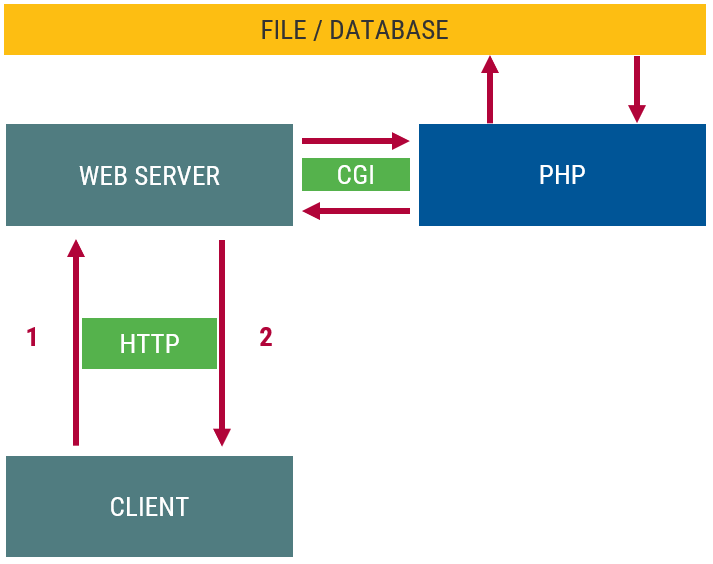

::: title
Webprogramozás
:::

### Környezeti változók, adattárolás

:::::: {.columns}
::: {.column width="33%"}
<small>
**Visnovitz Márton**  
egyetemi tanársegéd  
visnovitz.marton@inf.elte.hu
</small>
:::
::: {.column width="33%"}
<small>
**Horváth Győző**  
egyetemi docens  
horvath.gyozo@inf.elte.hu
</small>
:::
::::::
------

## Ismétlés {data-state="new-section"}

------

## Ismétlés

- [X] Output
  - [X] dinamikus sablon
  - [X] alternatív szintaxis
- [ ] Input
  - [X] Kliens
  - [ ] Környezet
  - [ ] Fájl
  - [ ] Adatbázis
  - [ ] Munkamenet
- [X] Űrlapfeldolgozás
  - [X] Beolvasás, ellenőrzés (`$_POST`, `$_GET`)
  - [X] Adatok (nincsen: `$_POST`, `$_GET`, HTML)
  - [X] Kimenet (HTML)

------

## Adatok a klienstől PHP-ig


------

## Szerverprogram bemeneti adatai


------

## Környezeti változók {data-state="new-section"}

------

## Szerveroldali program bemeneti adatai

A bemeneti program lehetséges forrásai:

- [X] Kliens
- [ ] **Környezet**
- [ ] Fájl
- [ ] Munkamenet
- [ ] Adatbázis
- [ ] Másik szerver

------

## Kérés körülményei és HTTP fejlécek

- Kérés körülményei → környezeti változók (`$_SERVER`)
  - HTTP kérés metódusa → `REQUEST_METHOD`
  - kliens IP címe → `REMOTE_ADDRESS`
  - üzenettest hossza bájtban → `CONTENT_LENGTH`
- HTTP fejlécek → környezeti változók
  - `HTTP_*`
  - Pl. `Accept` fejléc → `HTTP_ACCEPT` környezeti változó

```txt
[REMOTE_ADDR] => 188.142.184.197
[REMOTE_PORT] => 49323
[REQUEST_METHOD] => GET
[HTTP_ACCEPT] => text/html,application/xhtml+xml,application/xml
[HTTP_ACCEPT_LANGUAGE] => hu-hu,hu;q=0.8,en-US;q=0.5,en;q=0.3
```
------

## URL

- Kérés URL-je (szabad paraméter: `<query>`)

    ```txt
    <protocol>://<host>:<port>/<path>?<query>#<fragment>
    ```

- URL → környezeti változók (fontos: `QUERY_STRING`)
    + `<protocol>`  → `SERVER_PROTOCOL`
    + `<host>`      → `SERVER_NAME`
    + `<port>`      → `SERVER_PORT`
    + `<path>`      → `SCRIPT_NAME (PATH_INFO)`
    + `<query>`     → `QUERY_STRING`

------

## HTTP üzenettörzs

- HTTP üzenettörzs szabad paraméter
- **Standard bemenet**en jelenik meg
- Környezeti változó
  - `CONTENT_LENGTH`: adatmennyiség hossza

------

## Környezeti változók -- példa

```txt
[HTTP_HOST] => webprogramozas.inf.elte.hu
[HTTP_USER_AGENT] => Mozilla/5.0 (Windows NT 6.1; WOW64; rv:19.0) Gecko/20100101 Firefox/19.0
[HTTP_ACCEPT] => text/html,application/xhtml+xml,application/xml;q=0.9,*/*;q=0.8
[HTTP_ACCEPT_LANGUAGE] => hu-hu,hu;q=0.8,en-US;q=0.5,en;q=0.3
[HTTP_ACCEPT_ENCODING] => gzip, deflate
[HTTP_REFERER] => http://webprogramozas.inf.elte.hu/~gyozke/wf2/temp/
[HTTP_COOKIE] => WACID=1263304129000A11327866; __utma=32143338.519822639.1361532995.1362426295.1363347264.4; __utmz=32143338.1362426295.3.3.utmcsr=google|utmccn=(organic)|utmcmd=organic|utmctr=(not%20provided)
[HTTP_CONNECTION] => keep-alive
[PATH] => /usr/sbin:/bin:/usr/bin:/sbin
[SERVER_SIGNATURE] => <address>Apache/2.2.10 (Linux/SUSE) Server at webprogramozas.inf.elte.hu Port 80</address>
[SERVER_SOFTWARE] => Apache/2.2.10 (Linux/SUSE)
[SERVER_NAME] => webprogramozas.inf.elte.hu
[SERVER_ADDR] => 157.181.161.8
[SERVER_PORT] => 80
[REMOTE_ADDR] => 188.142.184.197
[DOCUMENT_ROOT] => /srv/www/webprog
[SERVER_ADMIN] => root@webprogramozas.inf.elte.hu
[SCRIPT_FILENAME] => /home/gyozke/public_html/wf2/temp/getpost.php
[REMOTE_PORT] => 49323
[GATEWAY_INTERFACE] => CGI/1.1
[SERVER_PROTOCOL] => HTTP/1.1
[REQUEST_METHOD] => GET
[QUERY_STRING] => 
[REQUEST_URI] => /~gyozke/wf2/temp/getpost.php
[SCRIPT_NAME] => /~gyozke/wf2/temp/getpost.php
[PHP_SELF] => /~gyozke/wf2/temp/getpost.php
[REQUEST_TIME] => 1365626159
```

------

## Szuperglobális tömbök

- `$_GET`: `QUERY_STRING`ben érkező név=érték pároknak megfelelő tömb, ahol a név a kulcs.
- `$_POST`: a standard inputon érkező név=érték pároknak megfelelő tömb, ahol a név a kulcs.
- `$_SERVER`: az összes környezeti változót tartalmazza
- `$_FILES`: a feltöltött fájlok helyét tartalmazza
- `$_COOKIES`: a kliensről érkező sütik jelennek meg benne

------

## Adattárolás {data-state="new-section"}

Közös adat mint erőforrás megosztása

------

## Szerveroldali program bemeneti adatai

A bemeneti program lehetséges forrásai:

- [X] Kliens
- [X] Környezet
- [ ] **Fájl**
- [ ] Munkamenet
- [ ] Adatbázis
- [ ] Másik szerver

------

## Szkriptbeli változók

- Élettartamuk a szkript futása
- Utána megszűnnek

```php
if (isset($szamlalo)) {
  $szamlalo += 1;
} else {
  $szamlalo = 0;
}

var_dump($szamlalo);
```

------

## Külső adattárolás



------

:::::::::::::::::::: {.columns}
::: {.column style="width: 45%"}
### Fájl

- bármikor elérhető, nincs szükség plusz szoftverekre
- könnyen értelmezhető (ember, program)
- könnyen használható
- viszonylag kis méretű
:::

::: {.column style="width: 45%"}
### Adatbázis

- biztonságos
- típusos adatok / séma
- bonyolult adatszerkezetek
- összetett kereshetőség
- fejlett konkurenciakezelés
:::
::::::::::::::::::::

------

## Fájlkezelés PHP-ban {data-state="new-section"}

------

## Fájlműveletek PHP-ban

- Lehetőség fájlok használatára (írás, olvasás, stb.)
- A szerver helyi fájljai elérhetőek (fájlrendszer)
- Sokféle nyelvi lehetőség
- Tipikus folyamat
  - megnyitás
  - feldolgozás
  - bezárás

------

## Alacsony szintű általános fájlműveletek

:::::::::::::::::::: {.columns}
::: {.column style="width:33%"}
- `fopen()`
- `fclose()`
- `feof()`
:::
::: {.column style="width:33%"}
- `fread()`
- `fscanf()`
- `fgets()`
- `fgetcsv()`
:::
::: {.column style="width:33%"}
- `fwrite()`
- `fprintf()`
- `fputcsv()`
:::
::::::::::::::::::::

## Fájlrendszer-műveletek

:::::::::::::::::::: {.columns}
::: {.column style="width:33%"}
- `mkdir()`
- `rmdir()`
- `copy()`
- `rename()`
- `unlink()`
:::
::: {.column style="width:33%"}
- `basename()`
- `dirname()`
- `realpath()`
- `chown()`
- `chmod()`
- `chgrp()`
- `stat()`
:::
::: {.column style="width:33%"}
- `is_dir()`
- `is_file()`
- `is_readable()`
- `is_writable()`
- `is_link()`
- `is_executable()`
:::
::::::::::::::::::::

------

## Magas szintű fájlműveletek

- Beolvasás
  - `$array = file($filename[, $modifiers])`  
    fájl soronként a tömbbe
  - **`$data = file_get_contents($filename)`**  
    egész fájl szövegként
  - `readfile($filename)`  
    fájl kimenetre írása (pl. képek kiírása)
- Kiírás
  + **`file_put_contents($filename, $data)`**  
    szöveg fájlba írása

------

## Fájlszerkezet- vs adatszerkezet-vezérelt tárolás {data-state="new-section"}

------

## Összehasonlítás

:::::::::::::::::::: {.columns}
::: {.column style="width:33%"}
**Fájlszerkezet-vezérelt**

- Saját mikroformátum
- Áttekinthetőség
- Interoperabilitás
- → Magas és alacsony szintű fájlműveletek
:::
::: {.column style="width:33%"}
**Adatszerkezet-vezérelt**

- Adatszerkezet mentése és betöltése
- A fájl tartalma és szerkezete nem érdekes
- Az adat rendelkezésre állása az érdekes
- Adatszerkezet → szöveges formátum
- → **sorosítás** + magas szintű fájlműveletek
:::
::::::::::::::::::::

------

## Fájlszerkezet-vezérelt

Adott egy **rekordokból álló tömb**. Végezzük el a kiírását úgy, hogy egy sorban egy rekordnyi információ legyen, az egyes értékeket soron belül **tabulátorral** válasszuk el!

```php
$films = [
  [
    "title"     => "The Passion of the Christ",
    "director"  => "Mel Gibson",
    "year"      => "2004",
  ],
  [
    "title"     => "Alien",
    "director"  => "Ridley Scott",
    "year"      => "1979",
  ],
];
```

------

## Fájlszerkezet-vezérelt (mentés)

```php
$file = @fopen("films.txt", "w");

if (!$file) {
  die("File not found!");
}

foreach ($films as $film) {
  fputcsv($file, $film, "\t");
}

fclose($file);
```

```txt
Passion of the Christ   Mel Gibson  2004
Alien   Ridley Scott    1979
```

------

## Fájlszerkezet-vezérelt (betöltés)

Az előző példában kapott fájlt olvassuk be rekordok tömbjeként!

```txt
Passion of the Christ   Mel Gibson  2004
Alien   Ridley Scott    1979
```

```php
$films = [];
$file = @fopen("films.txt", "r");

if (!$file) {
  die("File not found!");
}

while ($row = fgetcsv($f, 0, "\t")) {
  $films[] = [
    "title"    => $row[0],
    "director" => $row[1],
    "year"     => $row[2],
  ];
}
fclose($f);
```

------

## Konkurens fájlhasználat

:::::::::::::::::::: {.columns}
::: {.column style="width:40%"}
Ha egyszerre többen hívják meg a szkriptet  
→ konkurens használat

- `flock($f, $op)`
  - `$op`
    - `LOCK_SH` (read)
    - `LOCK_EX` (write)
    - `LOCK_UN` (unlock)
:::

::: {.column style="width:60%"}
```php
$file = @fopen("films.txt", "w");

if (!$file) {
  die("File not found!");
}

✒>if (flock($file, LOCK_EX)) {<✒
  foreach ($filmek as $film) {
    fputcsv($file, $film, "\t");
  }
  ✒>flock($file, LOCK_UN);<✒
}

fclose($file);
```
:::
::::::::::::::::::::

------

## Konkurens fájlhasználat

:::::::::::::::::::: {.columns}
::: {.column style="width:40%"}
Olvasáshoz is érdemes lockolni a fájlt, hogy közben ne kezdődhessen el egy írási folyamat.
:::

::: {.column style="width:60%"}
```php
$films = [];
$file = @fopen("films.txt", "r");

if (!$file) {
  die("File not found!");
}

✒>if (flock($file, LOCK_SH)) {<✒
  while ($row = fgetcsv($f, 0, "\t")) {
    $films[] = [
      "title"    => $row[0],
      "director" => $row[1],
      "year"     => $row[2],
    ];
  }
  ✒>flock($file, LOCK_UN);<✒
}
fclose($file);
```
:::
::::::::::::::::::::

------

## Adatszerkezet-vezérelt 

- Egy adatszerkezet visszaalakítható  
  szöveges megfelelője.
- Sorosító függvények
  + `serialize($érték)` → szöveg
  + `unserialize($szöveg)` → érték
  + `json_encode($érték)` → szöveg
  + `json_decode($szöveg)` → érték

------

## Példa

```php
$films = [
  [
    "title"     => "The Passion of the Christ",
    "director"  => "Mel Gibson",
    "year"      => "2004",
  ],
  [
    "title"     => "Alien",
    "director"  => "Ridley Scott",
    "year"      => "1979",
  ],
];
```

------

## `serialize`, `unserialize`

PHP saját sorosítási formátuma, típusinformációt is tartalmaz.

```php
✒>$data = serialize($films);<✒
// a:2:{i:0;a:3:{s:5:"title";s:25:"The Passion of the Christ";s:8:"director";s:10:"Mel Gibson";s:4:"year";s:4:"2004";}i:1;a:3:{s:5:"title";s:5:"Alien";s:8:"director";s:12:"Ridley Scott";s:4:"year";s:4:"1979";}}
✒>$films2 = unserialize($data);<✒
/*
array(2) {
  [0]=>
  array(3) {
    ["title"]=>
    string(25) "The Passion of the Christ"
    ["director"]=>
    string(10) "Mel Gibson"
    ["year"]=>
    string(4) "2004"
  }
  [1]=>
  array(3) {
    ["title"]=>
    string(5) "Alien"
    ["director"]=>
    string(12) "Ridley Scott"
    ["year"]=>
    string(4) "1979"
  }
}
*/
```

------

## `json_encode`, `json_decode`

JSON formátum - széles körben elterjedt.  
JavaScript: `JSON.stringify()`, `JSON.parse()`

```php
✒>$data = json_encode($films, JSON_PRETTY_PRINT);<✒
/*
[
    {
        "title": "The Passion of the Christ",
        "director": "Mel Gibson",
        "year": "2004"
    },
    {
        "title": "Alien",
        "director": "Ridley Scott",
        "year": "2000"
    }
]
*/
✒>$films2 = json_decode($data, TRUE);<✒
/*
array(2) {
  [0]=>
  array(3) {
    ["title"]=>
    string(25) "The Passion of the Christ"
    ["director"]=>
    string(10) "Mel Gibson"
    ["year"]=>
    string(4) "2004"
  }
  [1]=>
  array(3) {
    ["title"]=>
    string(5) "Alien"
    ["director"]=>
    string(12) "Ridley Scott"
    ["year"]=>
    string(4) "1979"
  }
}
*/
```

------

## Segédfüggvények

```php
function load_from_file($filename, $default_data = []) {
  $data = @file_get_contents($filename);
  return ($data === false 
    ? $default_data 
    : json_decode($data, TRUE));
}

function save_to_file($filename, $data) {
  $file_data = json_encode($data);
  return file_put_contents($filename, $file_data, LOCK_EX);
}
```

Akármilyen adatszerkezetre működik, de típusinformációk elveszhetnek!

------

## Példa -- új film hozzáadása

```php
const FILMS_DATAFILE = "films.json";
$films = load_from_file(FILMS_DATAFILE);

$films[] = [
  "title"    => "Braveheart",
  "director" => "Mel Gibson",
  "year"     => "1995"
];

save_to_file(FILMS_DATAFILE, $films);
```

------

## Hátrányok

- Sok adat mozgatása
- Rossz konkurencia-kezelés
- Manuális szűrés
- → **magasabb szintű absztrakció**

------

## `IFileIO` és `IStorage` interface-k

Cél: egy olyan interfész amivel elrejtjük a tárolás módját

```php
interface IFileIO {
  function save();
  function load();
}

interface IStorage {
  function __construct($connection_params);
  function add($record);
  function findById($id);
  function findAll($params = []);
  function findOne($params = []);
  function query($condition);
  function update($id, $record);
  function delete($id);
}
```

------

## `Storage`

```php
abstract class Storage implements IStorage, IFileIO {
  protected $contents;
  protected $filepath;

  abstract function load();
  abstract function save();

  public function __construct($filename) {
    if (!is_readable($filename) || !is_writable($filename)) {
      throw new Exception("Data source ${filename} is invalid.");
    }

    $this->filepath = realpath($filename);
    $this->load();
  }

  public function __destruct() {
    $this->save();
  }

  public function add($record) {
    $id = uniqid();
    $this->contents[$id] = $record;
    return $id;
  }

  public function findById($id) {
    return $this->contents[$id] ?? NULL;
  }

  public function findAll($params = []) {
    return array_filter($this->contents, function ($item) use ($params) {
      foreach ($params as $key => $value) {
        if ($item[$key] !== $value) {
          return FALSE;
        }
      }

      return TRUE;
    });
  }

  public function findOne($params = []) {
    $found_items = $this->findAll($params);
    return $found_items[0] ?? NULL;
  }

  public function query($condition) {
    return array_filter($this->contents, $condition);
  }

  public function update($id, $record) {
    $this->contents[$id] = $record;
  }

  public function delete($id) {
    unset($this->contents[$id]);
  }
}
```

------

## `JsonStorage` / `SerializeStorage`

```php
class JsonStorage extends Storage {
  public function load() {
    $file_contents = file_get_contents($this->filepath);
    $this->contents = json_decode($file_contents, TRUE) ?? [];
  }

  public function save() {
    $json_content = json_encode($this->contents, JSON_PRETTY_PRINT);
    file_put_contents($this->filepath, $json_content);
  }
}

class SerializeStorage extends Storage {
  public function load() {
    $file_contents = file_get_contents($this->filepath);
    $this->contents = unserialize($file_contents) ?? [];
  }

  public function save() {
    $file_content = serialize($this->contents);
    file_put_contents($this->filepath, $file_content);
  }
}
```

------

## Használat

```php
$filmStorage = new JsonStorage("films.json");

$allFilms = $filmStorage->findAll();

$filmsByMelGibson = $films->findAll([
  "director" => "Mel Gibson"
]);

$newFilm = [
  "title" => "Star Wars",
  "director" => "George Lucas",
  "year" => "1977"
];

$id = $filmStorage->add($newFilm);
$newHope = $filmStorage->findById($id);
$newHope["title"] = "A New Hope";
$filmStorage->update($id, $newHope);
```

------

## `Storage` kiterjesztése

```php
function getMoviesByYear($year) {
  $filmStorage = new JsonStorage("films.json");
  return $filmStorage->query(function ($movie) use ($year) {
    return $movie["year"] === $year;
  });
}
// OR
$filmStorage = new FilmStorage();
$films = $filmStorage->getMoviesByYear(2016);
```
```php
class FilmStorage extends JsonStorage {
  public function __construct() {
    parent::__construct("films.json");
  }

  public function getMoviesByYear($year) {
    return $this->findAll([
      "year" => $year
    ]);
  }
}
```

------

## Storage osztályokkal

A `findAll` művelet nem működik!

```php
abstract class ObjectStorage extends Storage {
  public function findAll($params = []) {
    return array_filter($this->contents, function ($item) use ($params) {
      foreach ($params as $key => $value) {
        if (✒>$item->$key<✒ !== $value) {
          return FALSE;
        }
      }

      return TRUE;
    });
  }
}

abstract class SerializeObjectStorage extends ObjectStorage {/* */}
```

------

## Storage osztályokkal

```php
class Film {
  public $title;
  public $year;
  public $director;

  public function __construct($title = NULL, $director = NULL, $year = NULL) {
    $this->title = $title;
    $this->director = $director;
    $this->year = $year;
  }
}

$filmStorage = new SerializeObjectStorage("films.storage");
$filmStorage->add(new Film("Star Wars", "George Lucas", "1977"));
```

------

## Összefoglalás {data-state="topic"}

- Környezeti változók a `$_SERVER` változón keresztül
- Az adat van a központban
- Tárolás fájlban: **Adatszerkezet-vezérelt**
- `JsonStorage`, `SerializeStorage`

------

## Kész kódok

```php
interface IFileIO {
  function save();
  function load();
}

interface IStorage {
  function __construct($connection_params);
  function add($record);
  function findById($id);
  function findAll($params = []);
  function findOne($params = []);
  function query($condition);
  function update($id, $record);
  function delete($id);
}

abstract class Storage implements IStorage, IFileIO {
  protected $contents;
  protected $filepath;

  abstract function load();
  abstract function save();

  public function __construct($filename) {
    if (!is_readable($filename) || !is_writable($filename)) {
      throw new Exception("Data source ${filename} is invalid.");
    }

    $this->filepath = realpath($filename);
    $this->load();
  }

  public function __destruct() {
    $this->save();
  }

  public function add($record) {
    $id = uniqid();
    $this->contents[$id] = $record;
    return $id;
  }

  public function findById($id) {
    return $this->contents[$id] ?? NULL;
  }

  public function findAll($params = []) {
    return array_filter($this->contents, function ($item) use ($params) {
      foreach ($params as $key => $value) {
        if ($item[$key] !== $value) {
          return FALSE;
        }
      }

      return TRUE;
    });
  }

  public function findOne($params = []) {
    $found_items = $this->findAll($params);
    return $found_items[0] ?? NULL;
  }

  public function query($condition) {
    return array_filter($this->contents, $condition);
  }

  public function update($id, $record) {
    $this->contents[$id] = $record;
  }

  public function delete($id) {
    unset($this->contents[$id]);
  }
}

abstract class ObjectStorage extends Storage {
  public function findAll($params = []) {
    return array_filter($this->contents, function ($item) use ($params) {
      foreach ($params as $key => $value) {
        if ($item->$key !== $value) {
          return FALSE;
        }
      }

      return TRUE;
    });
  }
}

class JsonStorage extends Storage {
  public function load() {
    $file_contents = file_get_contents($this->filepath);
    $this->contents = json_decode($file_contents, TRUE) ?? [];
  }

  public function save() {
    $json_content = json_encode($this->contents, JSON_PRETTY_PRINT);
    file_put_contents($this->filepath, $json_content);
  }
}

class SerializeStorage extends Storage {
  public function load() {
    $file_contents = file_get_contents($this->filepath);
    $this->contents = unserialize($file_contents) ?? [];
  }

  public function save() {
    $file_content = serialize($this->contents);
    file_put_contents($this->filepath, $file_content);
  }
}

class SerializeObjectStorage extends ObjectStorage {
  public function load() {
    $file_contents = file_get_contents($this->filepath);
    $this->contents = unserialize($file_contents) ?? [];
  }

  public function save() {
    $file_content = serialize($this->contents);
    file_put_contents($this->filepath, $file_content);
  }
}
```