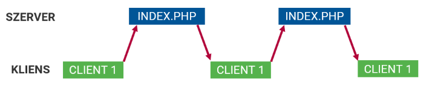
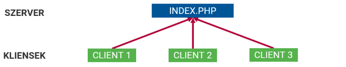
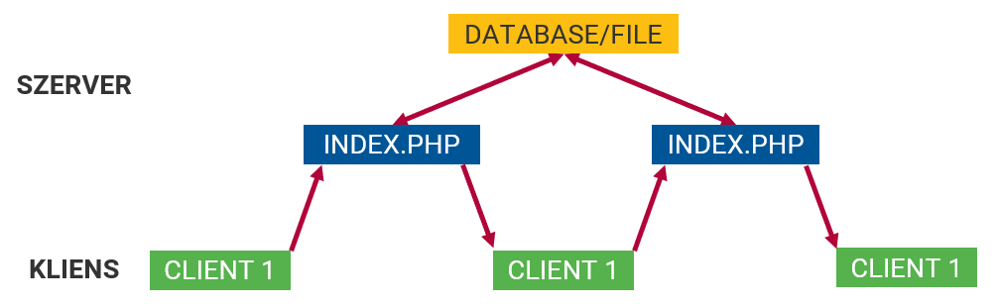
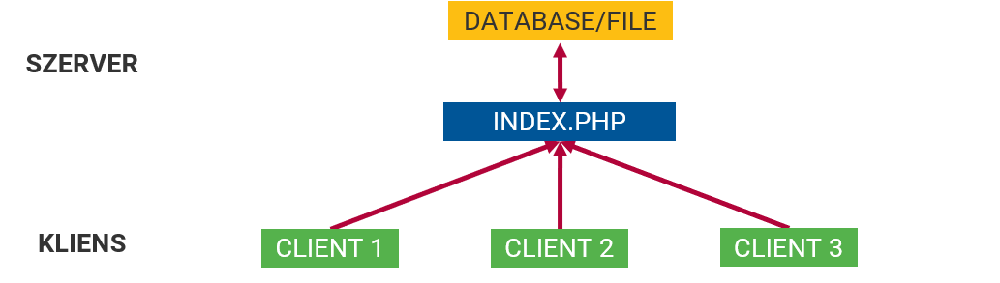
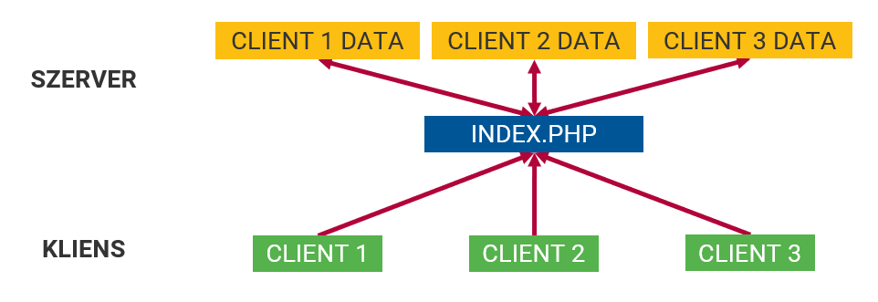
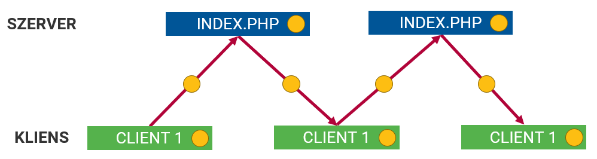
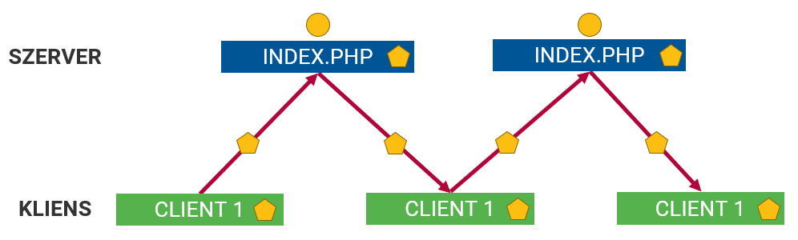

::: title
Webprogramozás
:::

### Munkamenet, hitelesítés

:::::: {.columns}
::: {.column width="33%"}
<small>
**Visnovitz Márton**  
egyetemi tanársegéd  
visnovitz.marton@inf.elte.hu
</small>
:::
::: {.column width="33%"}
<small>
**Horváth Győző**  
egyetemi docens  
horvath.gyozo@inf.elte.hu
</small>
:::
::::::

------

## Ismétlés {data-state="new-section"}

------

## Ismétlés

- [X] Output generálás
- [ ] Input
  - [X] Kliens
  - [X] Környezet
  - [X] Fájl
    - Fájlszerkezet-vezérelt
    - Adatszerkezet-vezérelt
    - Segédosztályok
  - [ ] ~~Adatbázis~~
  - [ ] Munkamenet
- [X] Űrlapfeldolgozás

------

## Példa


```php
$filmStorage = new JsonStorage("films.json");

$allFilms = $filmStorage->findAll();

$filmsByMelGibson = $films->findAll([
  "director" => "Mel Gibson"
]);

$newFilm = [
  "title" => "Star Wars",
  "director" => "George Lucas",
  "year" => "1977"
];

$id = $filmStorage->add($newFilm);
$newHope = $filmStorage->findById($id);
$newHope["title"] = "A New Hope";
$filmStorage->update($id, $newHope);
```

[Handout a `Storage` osztályok használatához](https://elte-fi.github.io/courses-webprogramming/handouts/storage.html)

------

## Szerverprogram bemeneti adatai


------

## Munkamenet-kezelés {data-state="new-section"}

------

## Szerveroldali program bemeneti adatai

A bemeneti program lehetséges forrásai:

- [X] Kliens
- [X] Környezet
- [X] Fájl
- [ ] **Munkamenet**
- [ ] Adatbázis
- [ ] Másik szerver

------

## HTTP állapotmentesség

- A HTTP állapotmentes protokoll
- Nem emlékezik az előző kérés adataira
- Függetlenül kezeli a kéréseket
    + Ugyanazon kliens különböző kéréseit
    + Különböző kliensek kéréseit




------

## 1. probléma

- Ugyanazon kliens több kérése között az állapot megtartása
- Pl. kosár
- Megoldás: HTTP kéréstől külön tárolni


------

## 1. probléma



------

## 2. probléma

Mindegyik kliens ugyanazon az adaton osztozkodik



------

## Megoldás: Munkamenet-kezelés

"Kliensenkénti adattárolás"



------

## Munkamenet-kezelés

- Kliensek megkülönböztetése
- Kliensenkénti adattárolás
- Példák:
  + levelezés, dokumentumok
  + internetbank
  + webáruház kosara, online szerkesztők
- Megoldás
  + kliens oldalon
  + szerver oldalon

------

## Munkamenet-kezelési lehetőségek {data-state="new-section"}

------

## Példa

Tároljuk egy számláló értékét felhasználónként, és minden kérésnél növeljük a számláló értékét eggyel!

------

## 1. ötlet: kliensoldali állapottartás

:::::::::::::::::::: {.columns}
::: {.column}
- Az adatot a kliensen tároljuk
- Minden kérésnél felküldjük a szerverre
- A szerver visszaadja a kliensnek
:::

::: {.column}
- Kliens oldali technológiák
  - URL
  - Rejtett mező
  - Süti
:::
::::::::::::::::::::



------

## 1/1: URL

```txt
session_url.php?counter=1
```

```php
<?php
$counter = ✒>$_GET["counter"]<✒ ?? 0;
$counter += 1;
?>
Counter value: <?= $counter ?> <br>
<a href="session_url.php?counter=✒><?= $counter ?><✒">Increment</a>
```

------

## URL

- Hátránya:
  - Minden linkhez oda kell generálni  
    (Ha egyről is lemarad, elvész az adat)
  - Sok adat nem fér el benne  
    (URL hossza limitált)
  - Feltűnő (zavaró)
  - **Könnyen átírható**
- Előny
  - Könyvjelzőzhető

------

## 1/2: rejtett mező

- URL: kevés adat, feltűnő, manipulálható
- → űrlap rejtett mezője

```html
<input type="hidden" name="counter" value="4">
```

:::::::::::::::::::: {.columns}
::: {.column}
- Előny
  - sok adat
  - nem feltűnő
:::

::: {.column}
- Hátrány
  - **manipulálható**
  - csak űrlapok esetén
  - normál linkeknél JavaScript kell
:::
::::::::::::::::::::

------

## Rejtett mező

```php
<?php
$counter = $_POST["counter"] ?? 0;
$counter += 1;
?>

Counter value: <?= $counter ?> <br>
<form action="" method="post">
  <input type="hidden" name="counter" value="<?= $counter ?>">
  <button type="submit">Increment</button>
</form>

<a href="session_hidden.php">Increment (not working)</a>
```

------

## 1/3: Süti

- Rejtett mező: macerás, manipulálható → süti
- HTTP kérés és PHP (`$_COOKIES`)

```txt
Cookie: név1=érték1; név2=érték2; név3=érték3
```

HTTP válasz és PHP:

```php
Set-Cookie: név=érték[; expires=dátum][; domain=domain][; path=path][; secure]
```

```php
// Cookie example
setcookie("foo", "bar");
setcookie("foo", "bar", time() + 60); // expires in 60 seconds
```

------

## Süti

```php
<?php
$counter = $_COOKIE["counter"] ?? 0;
$counter += 1;
setcookie("counter", $counter);
?>
Counter value: <?= $counter ?> <br>
<a href="session_cookie.php">Increment</a>
```

------

## Süti

:::::::::::::::::::: {.columns}
::: {.column}
- Előny
  - nem feltűnő
  - küldése automatikus
:::

::: {.column}
- Hátrány
  - **manipulálható**
  - limitált adatmennyiség
  - letiltható
:::
::::::::::::::::::::

------

## Kliensoldali megoldások

- Adat a kliensen van
- **Manipulálható**
- Sok adat esetén feleslegesen sok adat  
  megy oda-vissza a kliens és szerver között


------

## 2 ötlet: Szerveroldali állapottartás

- Tároljuk az adatot a szerveren
  - → nem manipulálható kliens oldalon
  - → nem kell sok adatot küldözgetni
- A kliens megkülönböztetése továbbra is szükséges
- → **tokent** kap, amivel azonosítja magát 
- → hozzáfér a **tokenhez** tartozó adatokhoz
- Token kliensoldali megoldással közlekedik
  - süti (alapértelmezett)
  - URL (ha nincs süti)

------

## Szerveroldali megoldás

Több kliens


------

## Szerveroldali megoldás

Egy kliens különböző kérései



------

## Szerveroldali megoldás

- Adatok tárolása
  - fájlban
  - adatbázisban
- Plusz erőforrás a szervertől
- A tokenre nagyon kell vigyázni!
  - ellopható
  - kilépés

------

## Munkamenet-kezelés PHP-ban {data-state="new-section"}

------

## Munkamenet-kezelés PHP-ban

- Munkamenethez tartozó adatok:
  - `$_SESSION`
- Munkamenet-kezelő függvények:
  - `session_start()`
  - `session_destroy()`
  - ...
- Gyakorlatban:
  - Klienshez tartozó változó, ami megőrzi  
    az értékét újratöltések között is
  
------

## Példa -- számláló 

```php
<?php
session_start();
$counter = $_SESSION["counter"] ?? 0;
$counter += 1;
$_SESSION["counter"] = $counter;
?>
Counter value: <?= $counter ?> <br>
<a href="session_php.php">Increment</a>
```

------

## Munkamenet megszüntetése

```php
session_start();

$_SESSION = [];

session_destroy();
```

------

## Szerveroldali program bemeneti adatai

A bemeneti program lehetséges forrásai:

- [X] Kliens
- [X] Környezet
- [X] Fájl
- [X] Munkamenet
- [ ] ~~Adatbázis~~
- [ ] ~~Másik szerver~~

------

## Hitelesítés és jogosultságkezelés {data-state="new-section"}

------

## Hitelesítés

:::::::::::::::::::: {.columns}
::: {.column style="width:50%"}
**Azonosítás**  
**(authentication)**

- Ki használja az alkalmazást?
- → azonosított felhasználó
  + felhasználónév, stb.
- → névtelen felhasználó
  + vendég

:::

::: {.column style="width:50%"}
**Jogosultságkezelés**  
**(authorization)**

- Engedélyezett-e a hozzáférése az adott felhasználónak?
- Bizonyos oldalak, funkciók csak azonosított felhasználók számára érhetőek el
:::
::::::::::::::::::::

------

## Technológiák

- `.htaccess`, `.htpasswd`
  - könyvtár alapú védelem
  - Apache webszerveken
- WWW-Authenticate
  - HTTP protokoll
  - Módok: Basic, Digest (titkosított)
  - PHP-ból kiolvasható
- Ezek PHP-tól független technológiák
- Plusz adat tárolására nem alkalmasak
- Csak hitelesítésre

------

## Hitelesítés munkamenettel

- Azonosított felhasználó munkamenetében egy speciális kulcsot helyezünk el
- Ezzel jelezzük, hogy már azonosítottuk
- Folyamat
  - beléptető űrlap
  - sikeres belépés esetén → kulcs
  - minden oldalon: ha ez a kulcs megvan, akkor azonosított
  - ettől függően más logika, más nézet lehet

------

## Átirányítás (segédfüggvény)

```php
function redirect($page) {
  header("Location: ${page}");
  exit();
}
```

------

## Regisztráció (HTML)

```php
<form action="signup.php" method="post">
  <div>
    <label for="username">Username: </label><br>
    <input type="text" name="username" id="username" value="<?= $username ?? "" ?>">
  </div>
  <div>
    <label for="password">Password: </label><br>
    <input type="password" name="password" id="password" value="<?= $password ?? "" ?>">
  </div>
  <div>
    <label for="fullname">Full name: </label><br>
    <input type="text" name="fullname" id="fullname" value="<?= $fullname ?? "" ?>">
  </div>
  <div>
    <button type="submit">Register</button>
  </div>
</form>

<?php foreach($messages as $message) : ?>
  <div class="<?= $message["type"] ?>"><?= $message["message"] ?></div>
<?php endforeach; ?>
```

------

## Regisztráció (Űrlap)

<div class="example">
<form action="signup.php" method="post">
 <div>
  <label for="username">Username: </label><br>
  <input type="text" name="username">
 </div>
 <div>
  <label for="password">Password: </label><br>
  <input type="password" name="password" id="password">
 </div>
 <div>
  <label for="fullname">Full name: </label><br>
  <input type="text" name="fullname" id="fullname">
 </div>
 <div>
  <button type="submit">Register</button>
 </div>
</form>
</div>

------

## Regisztráció (PHP)

```php
session_start();
$user_storage = new JsonStorage("storage/users.json");
$errors = [];

if (verify_post("username", "password", "fullname")) {
  $username = $_POST["username"];
  $password = $_POST["password"];
  $fullname = $_POST["fullname"];

  // Validate `username`, `password` and `fullname`
  // ...

  if (empty($errors)) {
    $user = [
      "username" => $username,
      "password" => ✒>password_hash($password, PASSWORD_DEFAULT)<✒,
      "fullname" => $fullname
    ];
    $user_storage->add($user);

    ✒>$_SESSION["user"] = $user;<✒
    ✒>redirect("login.php");<✒
  }
}
```

------

## Beléptetés (HTML)

```php
<form action="login.php" method="post">
  <div>
    <label for="username">Username: </label><br>
    <input type="text" name="username" id="username" value="<?= $username ?? "" ?>">
  </div>
  <div>
    <label for="password">Password: </label><br>
    <input type="password" name="password" id="password" value="<?= $password ?? "" ?>">
  </div>
  <div>
    <button type="submit">Log in</button>
  </div>
</form>

<?php foreach($messages as $message) : ?>
  <div class="<?= $message["type"] ?>"><?= $message["message"] ?></div>
<?php endforeach; ?>
```

------

## Beléptetés (Űrlap)

<div class="example">
<form action="login.php" method="post">
 <div>
  <label for="username">Username: </label><br>
  <input type="text" name="username" id="username">
 </div>
 <div>
  <label for="password">Password: </label><br>
  <input type="password" name="password" id="password">
 </div>
 <div>
  <button type="submit">Log in</button>
 </div>
</form>
</div>


------

## Beléptetés (PHP)

```php
session_start();
$user_storage = new JsonStorage("storage/users.json");
$errors = [];

if (verify_post("username", "password")) {
  $username = $_POST["username"];
  $password = $_POST["password"];

  $logged_in_user = $user_storage->query(
    function ($user) use ($username, $password) {
      return $user["username"] === $username && 
             password_verify($password, $user["password"]);
    }
  );

  if (!$logged_in_user) {
    $errors[] = "Invalid username or password";
  }

  if (empty($errors)) {
    ✒>$_SESSION["user"] = $logged_in_user;<✒
    ✒>redirect("index.php");<✒
  }
}
```

------

## Jogosultságkezelés (authorization)

- Többféle modell létezik
  - Csak azt nézzük be van-e lépve
  - Felhasználói azonosító alapján
  - Egyedi jogosultságok erőforrásokhoz
  - Szerepkörök alapján  
    (RBAC - Role-based Access Control)

------

## Jogosultságkezelés (authorization)

1. munkamenet indítása
2. van-e bejelentkezett felhasználó?
3. a bejelentkezett felhasználónak van-e jogosultsága?

```php
session_start();

function authorize() {
  return isset($_SESSION["user"]);
}

// OR

function authorize($required_role) {}
  return isset($_SESSION["user"]) &&
         in_array($required_role, $_SESSION["user"]["roles"]);
}
```

------

## Kijelentkezés

- Kulcs kivétele a munkamenetből
- Általában az egész munkamenet megszüntetése (feladatfüggő)

```php
function logout() {
  unset($_SESSION["user"]);
}
```

------

## Segédosztály

```php
class UserStorage extends JsonStorage {
  public $user = NULL;

  public function __construct() {
    parent::__construct("storage/users.json");

    if (isset($_SESSION["user-id"])) {
      $user_id = $_SESSION["user-id"];
      $this->user = $this->findById($user_id);
    }
  }

  public function register($username, $password, $fullname) {
    $user = [
      "username" => $username,
      "password" => password_hash($password, PASSWORD_DEFAULT),
      "fullname" => $fullname,
      "roles" => ["user"]
    ];

    return $this->add($user);
  }

  public function authenticate($username, $password) {
    $users = $this->query(function ($user) use ($username, $password) {
      return $user["username"] === $username && password_verify($password, $user["password"]);
    });

    if (empty($users)) {
      return FALSE;
    }

    $user_id = array_keys($users)[0];
    return $user_id;
  }

  public function isAuthenticated() {
    return !is_null($this->user);
  }

  public function authorize($roles = []) {
    if (!$this->isAuthenticated()) {
      return FALSE;
    }

    foreach ($roles as $role) {
      if (in_array($role, $this->user["roles"])) {
        return TRUE;
      }
    }

    return FALSE;
  }

  public function login($user_id) {
    $this->user = $this->findById($user_id);
    $_SESSION["user-id"] = $user_id;
  }

  public function logout() {
    $this->user = NULL;
    unset($_SESSION["user-id"]);
  }
}
```

------

## Segédosztály használata (regisztráció)

```php
session_start();
$user_storage = new UserStorage();
$errors = [];

if (verify_post("username", "password", "fullname")) {
  $username = $_POST["username"];
  $password = $_POST["password"];
  $fullname = $_POST["fullname"];

  if (empty($errors)) {
    $user_id = $user_storage->register($username, $password, $fullname);
    $user_storage->login($user_id);

    redirect("login.php");
  }
}
```

------

## Segédosztály használata (beléptetés)

```php
session_start();
$user_storage = new UserStorage();
$errors = [];

if (verify_post("username", "password")) {
  $username = $_POST["username"];
  $password = $_POST["password"];

  $user_id = $user_storage->authenticate($username, $password);
  if ($user_id === FALSE) {
    $errors[] = "Invalid username or password";
  }

  if (empty($errors)) {
    $user_storage->login($user_id);

    redirect("index.php");
  }
}
```

------

## Segédosztály használata (jogosultság ellenőrzés)

```php
session_start();
$user_storage = new UserStorage();

if (!$user_storage->authorize(["admin"])) {
  redirect("login.php");
};
```

------

## Összefoglalás {data-state="topic"}

- Munkamenet
  - kliensenkénti adattárolás
  - `session_start()`, `$_SESSION`
- Hitelesítés (authentication + authorization)
  - speciális kulcs a munkamenetben

------

## Fájlfeltöltés {data-state="new-section"}

------

## Űrlap és feldolgozás

```php
<form action="" method="post" enctype="multipart/form-data">
  <input type="file" name="file">
  <button>Upload</button>
</form>
<?php var_dump($errors); ?>
```

```php
$errors = [];
if ($_FILES) {
  if (array_key_exists("file", $_FILES) &&
      $_FILES["file"]["error"] == 0) {

    $from = $_FILES["file"]["tmp_name"];
    $to = "files/" . $_FILES["file"]["name"];
    move_uploaded_file($from, $to); 
  } else {
    $errors[] = "Error during upload!";
  }
}
```

------

## $_FILES

```txt
Array
(
  [file] => Array
    (
      [name] => Desert_small.jpg
      [type] => image/jpeg
      [tmp_name] => /tmp/php1750.tmp
      [error] => 0
      [size] => 18218
    )
)
```

------

## Könyvtárlista

```php
$files = scandir("files");
```

```html
<ul>
<?php foreach($files as $file) : ?>
  <li><?= $file ?></li>
<?php endforeach ?>
</ul>
```

------

## Fejlesztői környezet {data-state="new-section"}

------

## Fejlesztői környezet részei

- Szerver oldalon
  + webszerver
  + PHP
- Kliens oldalon
  + böngésző
- Fejlesztői környezet
  + Szerkesztő program (HTML, PHP, CSS)
  + SFTP, SCP kliens az állományok webszerverre töltéséhez

------

## Otthoni fejlesztéshez

- PHP fejlesztői szerver
  + `php -S localhost:3000`
- [XAMPP](https://www.apachefriends.org/index.html)
- [Bitnami stacks](http://bitnami.com/stacks/infrastructure)
  - WAMP, LAMP, MAMP

------


## Hasznos függvények {data-state="new-section"}

------

## Szövegműveletek

- szöveg: karakterek tömbje
- `explode($elválasztó, $s)`: elemekre bontás
- `implode($elválasztó, $tömb)`: összefűzés
- `substr($s, $kezdet, $hossz)`: részszöveg
- `ltrim($s)`, `rtrim($s)`, `trim($s)`: fehérszóköz-eltávolítás. 
- `strstr($miben, $mit)`, `strpos($miben, $mit)`, `strrpos($miben, $mit)`: részszöveg keresése
- `preg_match($minta, $s)`: regkif illeszkedése

------

## Dátum és idő

- `date($formátum)`: az aktuális idő kiírása a megadott formátumban.
- `time()`: Unix idő visszaadása másodpercben.
- `strtotime($s)`: szövegként megadott dátum Unix időbe átalakítása.
- `getdate()`: dátuminformációk visszaadása tömbként.
- `date_*`: dátummal kapcsolatos további függvények
- `DateTime`, `DateInterval`, `DatePeriod` osztályok

------

## Dátum és idő

```php
date("Y:m:d G:i:s"); // 2019:11:24 17:18:59
time(); // 1574615959 (s)
strtotime('2019-12-12'); // 1576108800
strtotime('2019-12-12T12:34:12'); // 1576154052
strtotime('now'); // 1574616109
strtotime('last day of next month'); // 1577813072

$d1 = new DateTime('+2 days');
$d2 = new DateTime('-2 weeks');
$interval = $d1->diff($d2);
$interval->format('%R%a days'); // -16 days

$d1 = new DateTimeImmutable('+2 days');
$d2 = $d1->add(new DateInterval('P2Y4DT6H8M'));
$interval = $d2->diff($d1);
$interval->format('%R%a days'); // -735 days
```

------

## HTTP fejlécek

- `header()`
  + HTTP fejlécek leküldése
  + Pl.: `header('Location: index.php');`
    * átirányítás másik oldalra

```php
function redirect($page) {
  header("Location: index.php?{$page}");
}
```

------

## Külön fájlba helyezés

- Funkcionálisan elváló részeket külön fájlokban tárolni
  + átláthatóság
- Fájlok beemelése:
  + `include($fájlnév)` – hiba esetén `warning`gal továbbmegy
  + `include_once($fájlnév)`
  + `require($fájlnév)` – hiba esetén hibával megáll
  + `require_once($fájlnév)`
- Mintha odamásolnánk a fájl tartalmát

